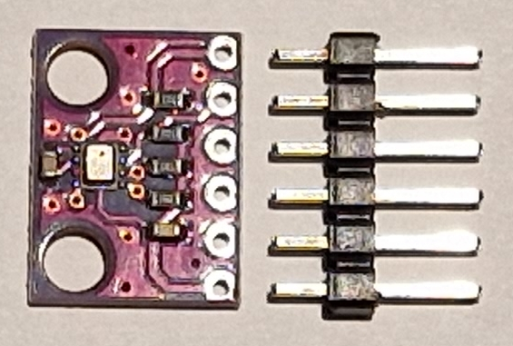
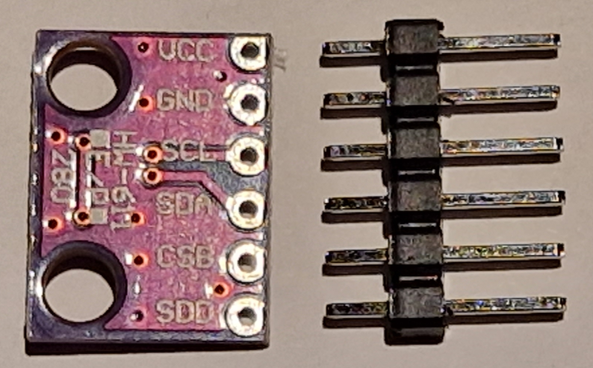
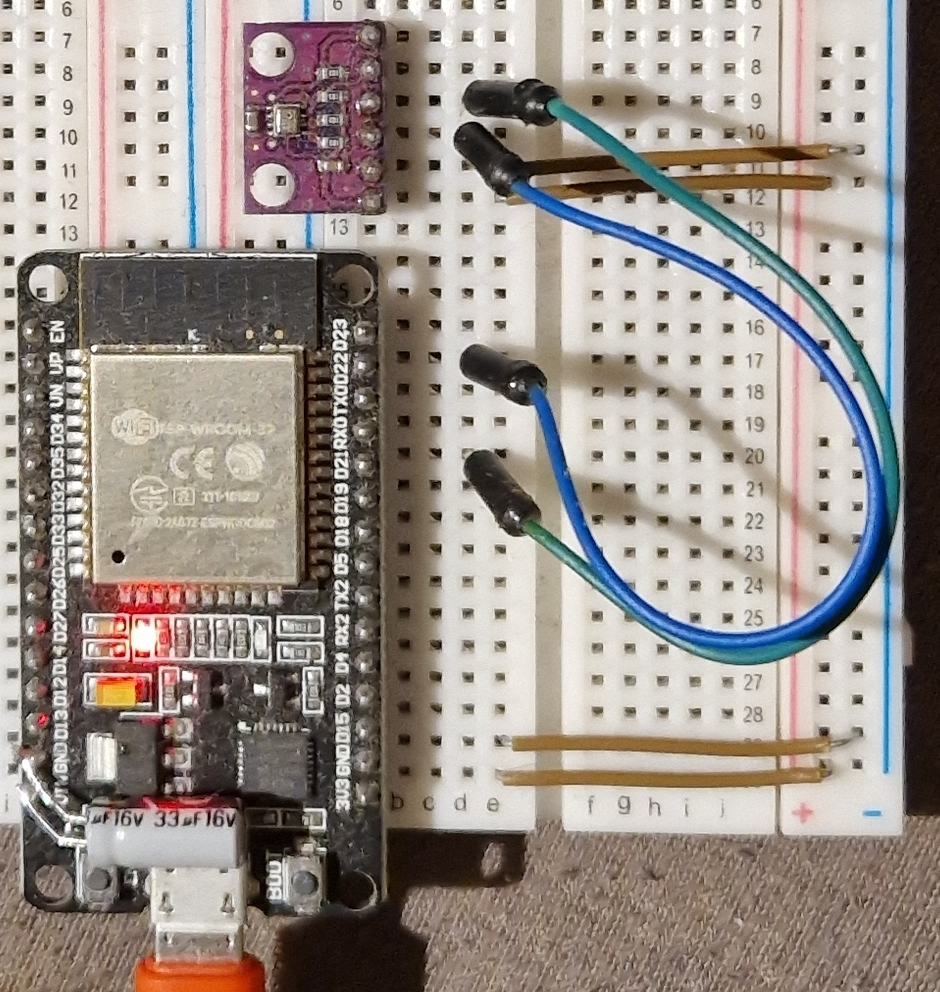

# BMP280

**Measure temperature and air pressure with a BMP280 chip and an ESP microcontroller**

The BMP280 is an inexpensive chip to measure temperature and air pressure (barometer). Connecting the BMP280 to an ESP microcontroller over I2C and set it up with ESPHome is quite easy.

State (2023.04): Measurements of temperature and air pressure is looking good


*BMP280 board (14.7 x 11.1 mm) with supplied pin header*

Technical data:

* Pressure range: 300~1100 hPa (accuracy: typ.: +-1 hPa, resolution: 0.16 Pa) -> corresponding sea level: -500 m to +9000 m
* Temperature range: -40~85 °C (accuracy: +- 1.0 °C, resolution: 0.01 °C)
* Interfaces: I2C & SPI
* I2C address: 0x76
* Supply voltage: 1.71~3.6 V
* Maximum current: 720 μA

The above data only provides an overview, for full details have a look at the datasheet: https://www.bosch-sensortec.com/media/boschsensortec/downloads/datasheets/bst-bmp280-ds001.pdf

Aliexpress ~2€ (2023.02)
Reichelt ~2€ (2023.04)

--------------------

## Connections

Connect the ESP microcontroller (ESP32 and ESP8266 will work) to the BMP280 over I2C with four wires:

| ESP | BMP280 | |
| ----------- | ----------- | ----------- |
| 3V3 | VCC | don't use 5V here! |
| GND | GND |
| GPIO22 | SCL |
| GPIO21 | SDA |


*BMP280 board back side with pinout*

German description how to connect the BMP280 to an ESP32: https://www.az-delivery.de/blogs/azdelivery-blog-fur-arduino-und-raspberry-pi/bmp280-am-esp32



*BMP280 board connected to an ESP32 using I2C and 3.3V power supply*

--------------------

## ESPHome

https://esphome.io/components/i2c.html
https://esphome.io/components/sensor/bmp280.html

Example yaml file:

 ```
 i2c:
  scl: GPIO22
  sda: GPIO21

sensor:
  - platform: bmp280
    temperature:
      name: "The Temperature"
      oversampling: 16x
    pressure:
      name: "The Pressure"
    address: 0x76
    update_interval: 10s
```

--------------------

## Accuracy Estimation

As I have a cheap chinese board with a (probably clone) BMP280 chip, I wanted to have a look at the accuracy ...

The Bosch BMP280 datasheet lists **+-1 hPa and +-1°C (at 0~65°C)** as the absolute accuracy.

### Example Temperature Measurement

Measured value from the BMP280: **19.5 °C**.

Measured value of LYWSD03MMC: 19.1 °C -> **difference: 0.4 °C** :-)

The measured temperature value was well within the accuracy range of another thermometer (Xiaomi LYWSD03MMC) in the room.

### Example Air Pressure Measurement

Measured value from the BMP280 (measured in Nürnberg): **981.6 hPa**.

The "official" air pressure value at Nürnberg (Airport): **1018 hPa**

At first, this difference confused me. I found out, that the "official" values are always normalized to sea level. Doing so, pressures from different locations can be directly compared, regardless of their measurement elevation.

Hint: The air pressure depends on the elevation. At sea level it is 1013 hPa, while at an elevation of 5500 it is reduced to only 500 hPa. For Nürnberg at 309m above sea level where my measuring was done, the official air pressure difference to sea level is 38 hPa.

To compare my measured value with the official one, I need to normalize this value also to the sea "reference" level, so 38 hPa must be added:

981.6 hPa + 38 hPa = 1019.6 hPa -> **difference: 1,6 hPa** :-|

The difference is a bit higher than the +-1 hPa accuracy from the datasheet. However, the resolution of the official values is only 1 hPa and I just don't know their accuracy. So the difference may even be within the expectable range.

#### Air Pressure Reference

Official pressure values at the Nürnberg airport - a few kilometres away from me (german): http://umweltdaten.nuernberg.de/wetterdaten/messstation-nuernberg-flugfeld/luftdruck/bereich/Tages-Ansicht.html
Pressure difference of 38 hPa between sea level and Nürnberg level (german): http://umweltdaten.nuernberg.de/fileadmin/Dokumente/Parameter/wetter_luftdruck.pdf

### Conclusion

It seems the measured values should be ok for hobbyists use. Long term reliability and accuracy still needs to be evaluated ...
