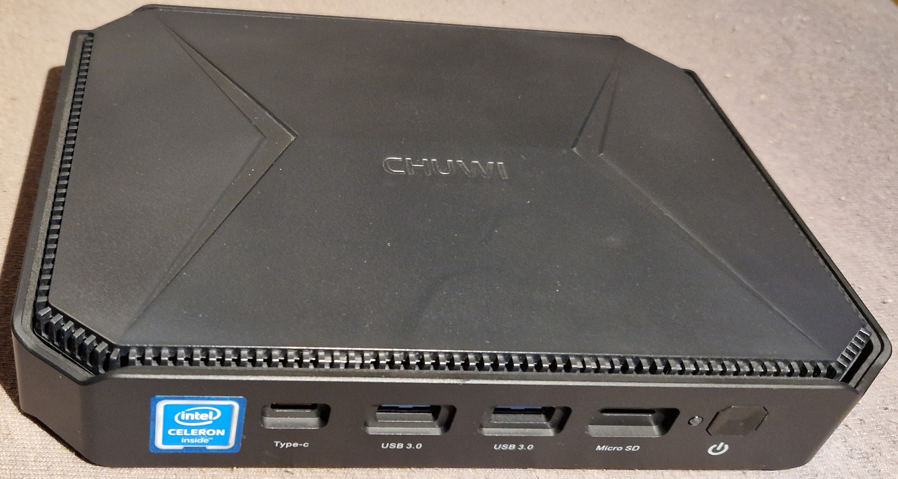
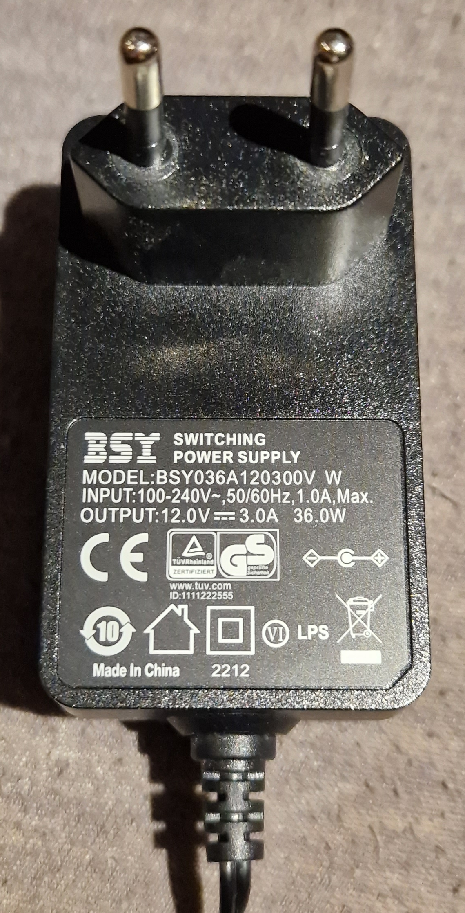

# Chuwi Herobox

My Home (Automation) **Server hardware running 24/7 with low power consumption**

*State (2023.11): Working just fine since 2022.01*

*Chuwi Herobox*

Technical data:
* Model: Chuwi Herobox
* Type: CWI527
* CPU: Intel Gemini Lake J4125 (Quad Core 64-Bit)
* RAM: 8GB (DDR3)
* SSD: 256GB (SATA, up to 2 TB)
* Interfaces: 2 x USB2, 2 x USB3, 1 x USB-C, 1 x LAN, 1 x HDMI (4K-UHD), 1 x VGA, 1 x Micro SD (up to 256 GB), 2.4G/5G Dual WiFi, 3.5 mm Audio
* Dimensions: 18,76 x 13,83 x 3,73 cm; 590 g
* Supply voltage: 12 V DC 3A (230 V AC power adapter included)

**Beware: Different Herobox variants are offered (CPU, fan/fanless, ...)**

Amazon: 219 € (2022.01)

Additional info links:
* https://www.chuwi.com/product/items/chuwi-herobox.html
* https://www.amazon.de/gp/product/B089F5SJJM/ref=ox_sc_act_title_1?smid=AJ5XJHI9PMS3P&psc=1

--------

## Usage

Used as 24/7 home server: Home Assistant, Nextcloud, Samba/SMB, git, ...

2023.11: Software is based on Linux running in several docker containers. Both memory and internal disk usage is around 30%, so there is enough room for future enhancements

Network services like Firewall, DHCP and such are intentionally provided by a different machine.

The provided Windows 11 license is unused.

## Hardware Selection

Some thoughts about my intended usage:
* several linux based services on a single box
* running 24/7 -> no "annoying" power on/off handling
* flexibility of solution -> standard linux x86 based (64 bit), no arm or dedicated NAS boxes
* low power consumption
* only occasional use -> idle power consumption important
* performance not that critical

Putting each linux service into its dedicated VM would be very flexible and secure. However, it would probably require at least 2 GB for each VM (maybe even more), in sum more RAM than low power/cheap boxes usually provide. Using docker container seems to be the right balance here and fits well into the 8 GB RAM the Herobox provides.

I've selected the Herobox due to the lower power consumption for 24/7 fanless operation and the reasonable price. The "medium" performance (although not bad) is not a limitation in my use case.

## Hardware Details

Hardware is fanless, small and usually won't get hot.

USB devices attached:
* File storage: 12 TB Seagate disk drive via USB3
* Ethernet: Choetech 2.5 GB Ethernet, uses Realtek RTL8156 via USB-C
* Zigbee: Sonoff "ZBDongle-P" via USB2

Hardware internals:
* WiFi chip: Qualcomm QCA9377, Linux module: ath10k_pci
* LAN chip: Intel I225-V -> failed with Ubuntu 20.04 LTS
* M.2 SSD port: Only SATA supported

The internal LAN chip doesn't work under Ubuntu 20.04 LTS, instead an external USB adapter is used. Internet comments indicates that Ubuntu 21.10 supports the LAN chip, but I haven't tested that.

### Performance

Cinebench R15 Multi: 296
Cinebench R15 Single: 79
Cinebench R20 Multi: 675
Cinebench R20 Single: 200
Cinebench R23 Multi: 1464
Cinebench R23 Single: 447

### Power Consumption

Idle:  3 W (USB disk stopped, CPU idle)
Load: 26 W (USB disk turning, serious calculations ongoing)

--------

## Pictures

*Chuwi Herobox Front: USB-C, USB3, USB3, Micro SD, Power LED, Power button*

*Chuwi Herobox Back: Reset "hole", DC12V, VGA, HDMI, LAN, 2xUSB 2, 3.5 mm audio*

*Power Adapter 12V 3A*
