# Ikea VINDRIKTNING

**Ikea air quality sensor (PM 2.5)**. DIY connected to Home Assistant with an ESP8266 and ESPHome

*State (2023.11): Working fine! However, I don't have any other PM 2.5 sensors to compare the measured values with.*

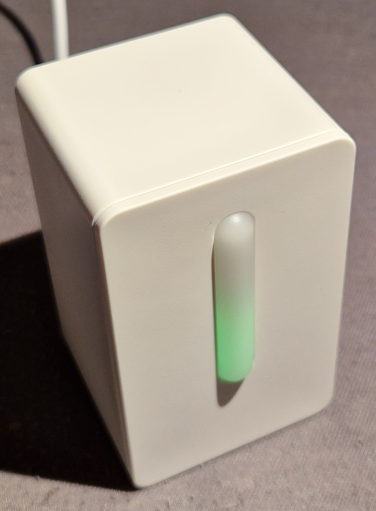
*Ikea VINDRIKTNING*

Features / technical data:
* Model: Ikea VINDRIKTNING (E2014)
* Functions: Air quality sensor (PM 2.5)
* Measured: Green/Amber/Red "LED traffic light" (values in μg/m³):
  * Green: 0-35 / Good + Low
  * Amber: 36-85 / OK + Medium
  * Red: 86- / Not good + High
* Range: 0~1000 μg/m³
* Power supply: 5V 0.1A (USB-C)
* Protocol: None
* Dimensions: 52x52x86 mm

With ESP8266 "DIY hack":
* Measured value: PM 2.5 (0.3μm ~ 10μm) in μg/m³
* Range: 0~1000 μg/m³
* Accuracy: ±20 μg/m³ or ±20 % of reading
* Resolution: 1 μg/m³
* Power supply: 5V 0.1A (USB-C)
* Protocol: WiFi

Link to Datasheet:
* Ikea VINDRIKTNING: https://www.ikea.com/de/de/p/vindriktning-luftqualitaetssensor-70498242/
* Cubic PM1006 (sensor): http://www.jdscompany.co.kr/download.asp?gubun=07&filename=PM1006_LED_PARTICLE_SENSOR_MODULE_SPECIFICATIONS.pdf

Ikea: 12,99 € (2023.11)

Additional info links (there are many pages to "DIY smartify" the VINDRIKTNING):
* https://style.oversubstance.net/2021/08/diy-use-an-ikea-vindriktning-air-quality-sensor-in-home-assistant-with-esphome/
* https://www.instructables.com/Connecting-a-IKEA-Vindriktning-to-Home-Assistant-U/
* https://arnowelzel.de/ikea-vindriktning-mit-tasmota-und-scd30

Remark: I'm assuming that the sensor used is a Cubic PM1006 as stated at several internet sources. On the sensor iself only "Cubic" is imprinted, I couldn't find any type/model markings on it.

--------

## Usage
The Ikea VINDRIKTNING indicates the air quality in the room by measuring particle mass concentration (PM) with a size of about 2.5 um. It displays the air quality with a simple LED traffic light (green/amber/red). Beside these three LEDs, it has no communication interface.

In a quiet room, the tiny fan inside is clearly noticeable even when 1m away and in addition to that, it turns on for 20s and then off for 10s. That really annoys me in the bedroom.

Both shortcomings (no interface and noticeable fan noise) can be hacked away relatively easy, if you know how to use a soldering iron and ESPHome :-)

### Air Quality
The VINDRIKTNING indicates "Particulate Matter" PM 2.5 (german: Feinstaub), which is the mass of particles with 2.5 μm or smaller in size, measured in μg/m³. The Cubic PM1006 sensor used here actually measures particles of 0.3μm ~ 10μm.

Other important air quality indicators for indoor rooms are NOT measured:

* Humidity: humans produce humidity (good indicator for ventilation)
* CO2: humans consume O2 and produce CO2 (good indicator for ventilation)
* TVOC: smells (TODO: Important?)
* CO: result of burning (gas oven, ...), high levels can be very dangerous

TODO: Add an air quality overview page 

### Power Consumption

Measured at mains power (incl. USB power adapter): 230V 0.3W (0.6W with D1 mini hack)

### Accuracy details
With the LED traffic light, only a rough estimation of the air quality can be made.

The Cubic PM1006 (LED particle sensor) is pretty inaccurate (±20 μg/m³ or ±20 % of reading) compared to more expensive ones that uses laser (e.g. Sensirion SPS30 with ±10%).

I don't have any other PM 2.5 sensors to compare it with.

However, to get a first impression about the air quality regarding PM 2.5, even the LED traffic light is "much better than nothing".

--------

## Hardware Hacks

With an ESP8266 (or ESP32) board and ESPHome, it is fairly easy to connect the VINDRIKTNING to Home Assistant and measure the PM 2.5 air quality value.

The "noisy" fan runs on 5V which can be heard even 1m away. When using 3.3 V from the ESP8266 instead, the fan runs completely silent, even if only 20 cm away. However, I don't know if that affects accuracy.

Many instructions can be found on the internet how to do these hacks.

As there is some room in the case and some pins at the ESP left, other sensors (BMP280, ...) could also be added ...

### Hardware Background Infos

The VINDRIKTNING consist of two main parts, a microcontroller controlling the LED traffic light and the Cubic PM1006 PM 2.5 sensor itself. Both communicate via a serial "UART" connection using 9600 baud.

To get the PM 2.5 measurement data, a Wemos Di mini running ESPHome is added that passively listens to the serial data coming from the sensor and provides that data via WiFi to Home Assistant. The control of the PM1006 sensor (e.g. initialisation) is still done by the VINDRIKTNING controller. There are instructions on the internet where the ESP8266 takes full control over the sensor, but I haven't tried that.

The fan runs on 5V and the VINDRIKTNING controller switches the ground side off cyclically every few seconds. Cutting the fans 5V line and connect it to 3.3 V from the ESP8266 board creates silence, but the fan is still running :-)

### ESP controller

Probably any ESP8266 or ESP32 could be used as only one serial line is needed. The small, cheap and easy to use "Wemos D1 mini" is a good choice.

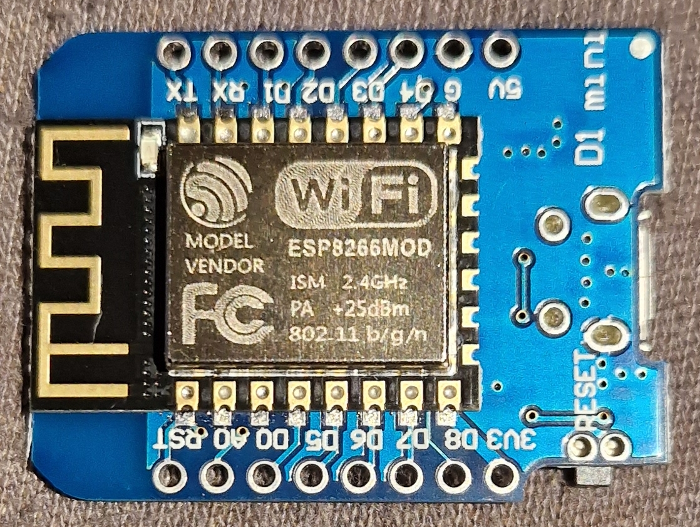
*D1 mini (ESP8266), antenna side*

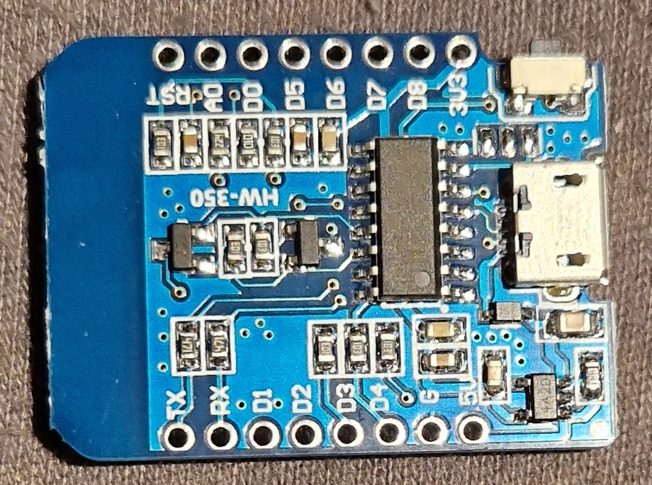
*D1 mini, USB side*

### Bill of Material

* Wemos D1 mini
* four thin wires
* one thin heat shrink (to isolate the fan wire)
* two small cable ties (to secure the D1 mini in the case)

Each item is very cheap and the price probably even below common shipping costs ...

### Connections

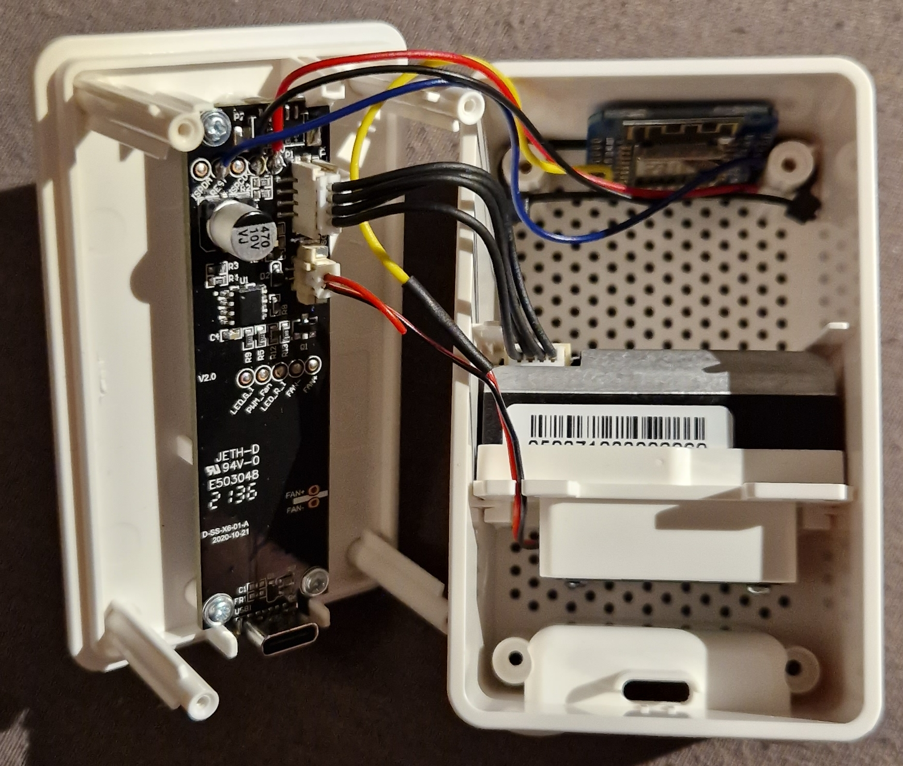
*Wirings done, D1 mini "secured" with cable ties*

Connect the VINDRIKTNING PCB (labeled solder pads at the PCB end) with the D1 mini:

| VINDRIKTNING | color | ESP |
| --- | --- | --- |
| ISPDA | - | - |
| REST | blue | D2 |
| ISPCLK | - | - |
| GND | black | G |
| 5V | red | 5V |

To run the fan at 3.3V with lower "silent" speed: Cut the 5V (red) line between the board connector and the fan. Connect the fan side to the 3.3 V (pin marked "3V3") of the D1 mini. A heat shrink avoid short cuts.

### Power Supply & Consumption

Power is supplied by USB-C. Measured consumption (incl. D1 mini and "fan hack") is:

* Startup          (10s): 5V * 0,11 A = 0,55W
* While fan is on  (20s): 5V * 0,10 A = 0,5W
* While fan is off (10s): 5V * 0,08 A = 0,4W

--------

## ESPHome

https://esphome.io/components/sensor/pm1006.html

Example config with common entries (api, wifi, ...) omitted:

```
esphome:
  name: "vindrik"
  friendly_name: vindrik

esp8266:
  board: d1_mini

...

uart:
  rx_pin: D2
  baud_rate: 9600

sensor:
  - platform: pm1006
    pm_2_5:
      name: "Particulate Matter 2.5µm"
```

## Home Assistant

A simple entity card showing the measured PM 2.5 value.

The actual entity should be easily found when looking for "matter". Hint: In this example, "vindrik" is the hostname of the ESP used and the µ special char of the sensor name is simply omitted.

```
type: entity
entity: sensor.vindrik_particulate_matter_25m
name: VINDRIKTNING PM 2.5
```


*Home Assistant showing PM 2.5 measured value*

## Images

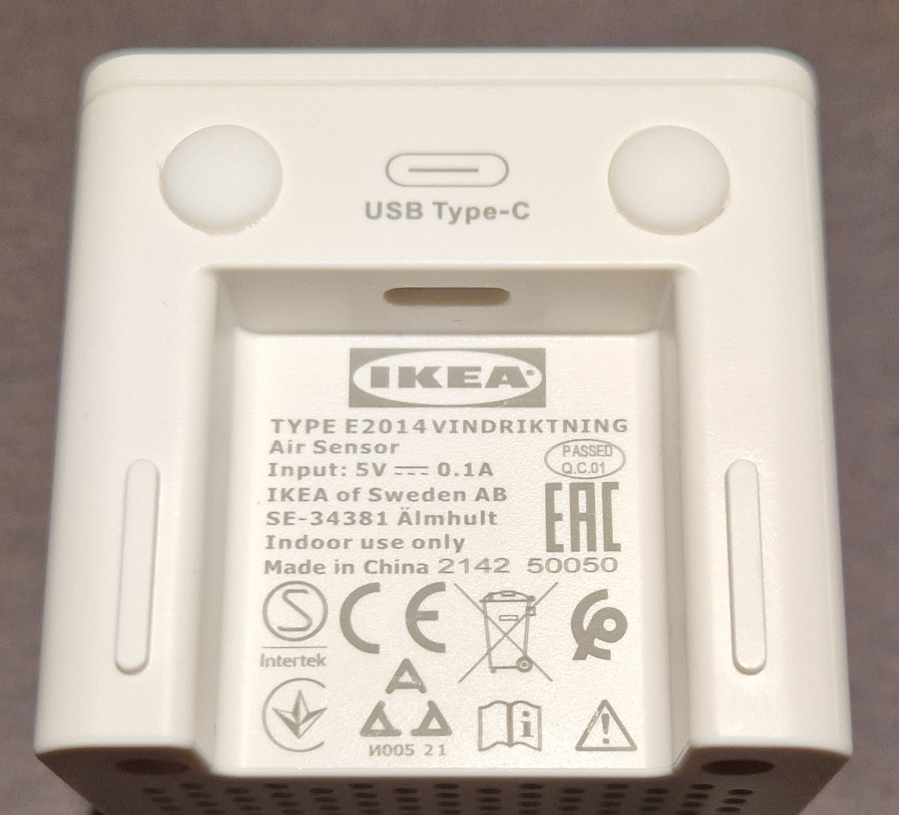
*Bottom with technical infos*
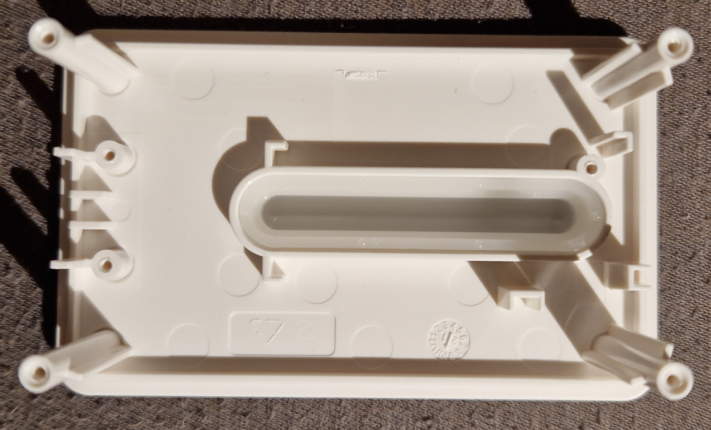
*Front with "LED window"*
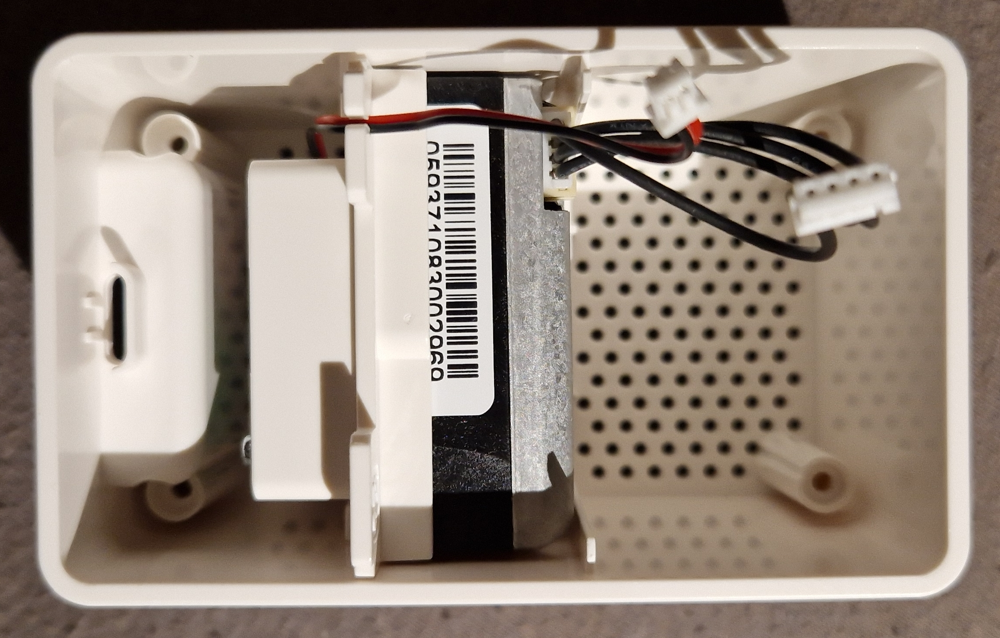
*Back with fan/sensor unit*
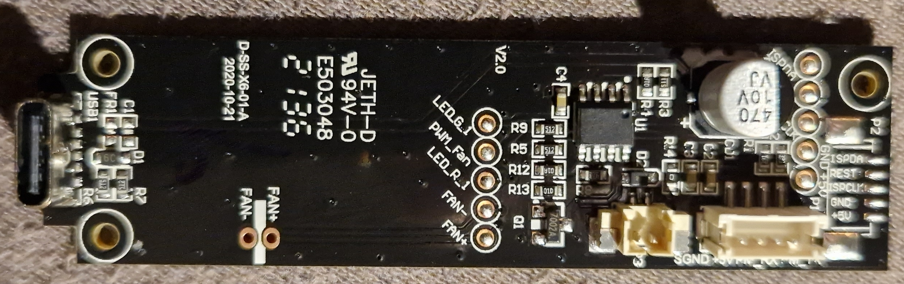
*PCB component side*
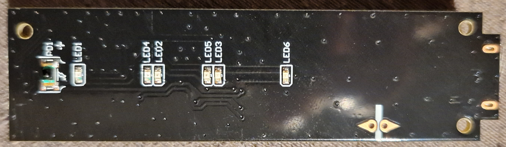
*PCB LED side*
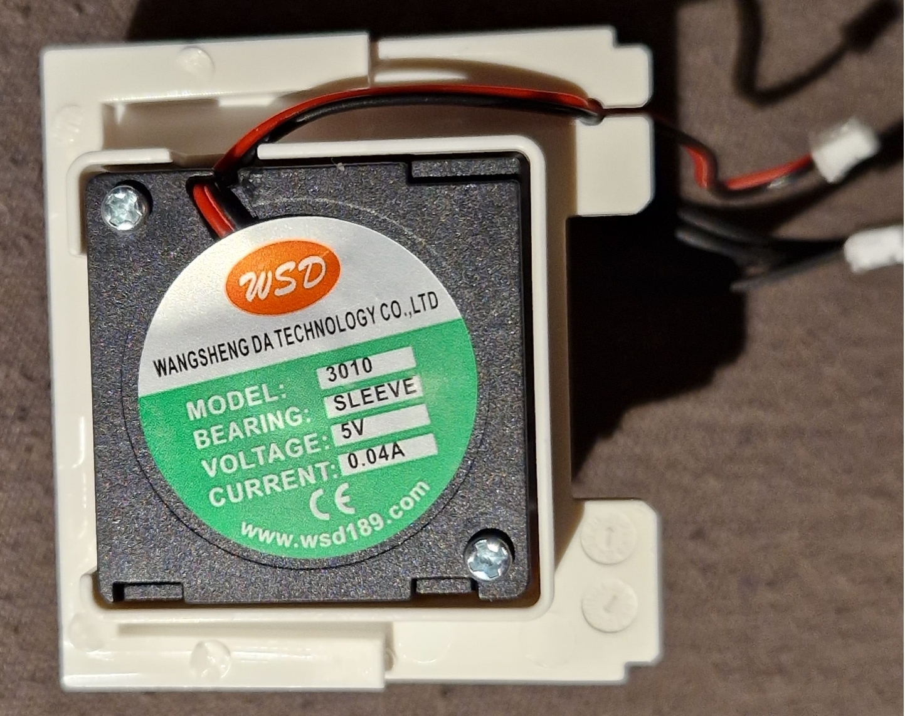
*Fan on mounting part*
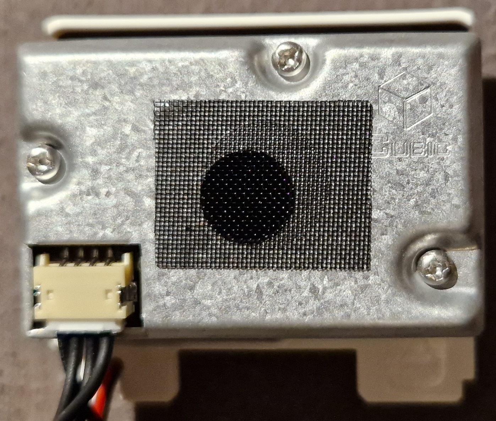
*PM 2.5 Sensor (Cubic PM1006)*
