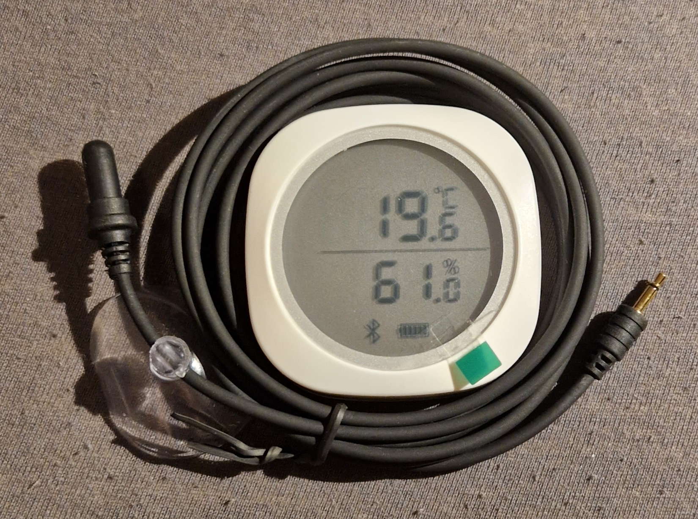

# Inkbird IBS-TH1 Plus

Temperature and humidity sensor with Bluetooth Low Energy (BLE), LCD and a waterproof temperature probe.

*State (2023.02): As the Bluetooth update rate and measured values seems unreliable in my Home Assistant, I regard this one as a fail for me. A test with the corresponding Engbird Android App works fine. So this seems to be a problem with ESPHome/HA.*


*Inkbird IBS-TH1 Plus with external waterproof probe*

Features:
* LCD
* Bluetooth Low Energy (BLE)
* Battery: 2*AAA
* Temperature range: -40~100 °C (external probe)
* Humidity range: 0~99% RH
* External temp probe is waterproof and has a suction cup
* Case has two magnets at the back
* Only the internal or external temp sensor can be used, not both
* Update rate is very low (several minutes) even on changes and can't be adjusted

eBay 21,59 (2022.02)

https://halfwheel.com/inkbird-ibs-th1-plus/296602/

With *sudo hcitool lescan* on Linux, the device appears with the name 'sps'.

## ESPHome: yaml file

https://esphome.io/components/sensor/inkbird_ibsth1_mini.html

```
esp32_ble_tracker:

sensor:
  - platform: inkbird_ibsth1_mini
    mac_address: 38:81:D7:01:02:03
    temperature:
      name: "Inkbird IBS-TH1 Temperature"
    external_temperature:
      name: "Inkbird IBS-TH1 External Temperature"
    humidity:
      name: "Inkbird IBS-TH1 Humidity"
    battery_level:
      name: "Inkbird IBS-TH1 Battery Level"
```

Obviously you need to adjust the *mac_address* to match your device.
