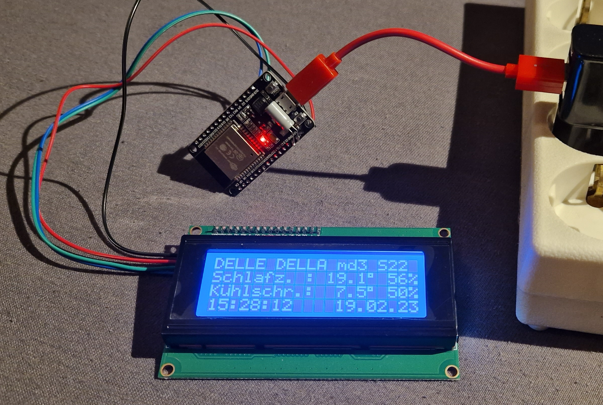
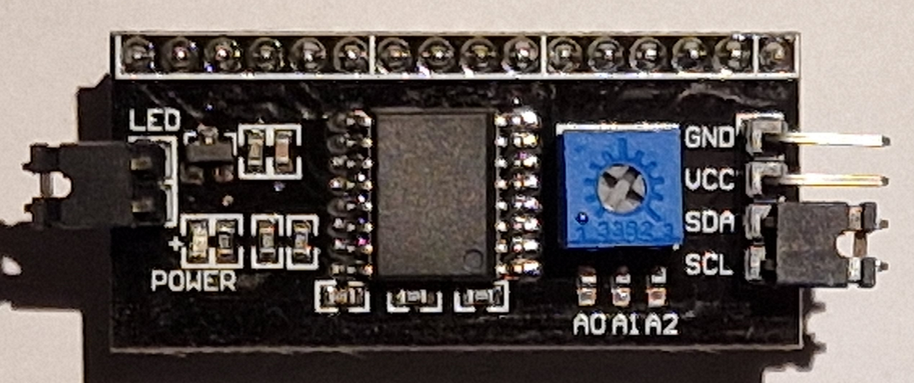
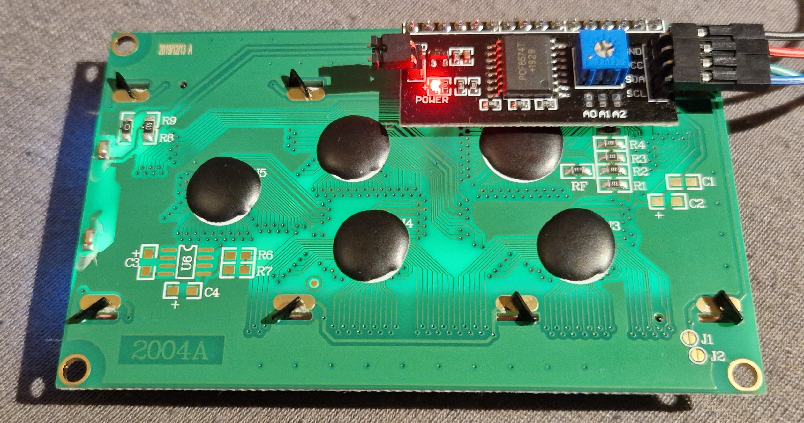
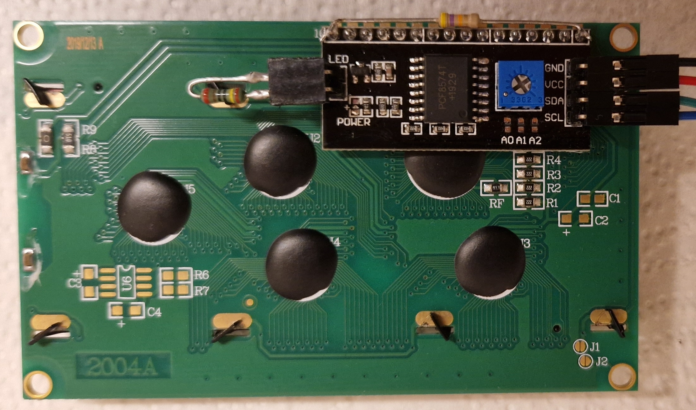

# LCD Character Display

**Show text infos from Home Assistant using an LCD character display and an ESP**

*State (2023.02): Character LCD 20x4 with ESP works just fine. Needs a casing ...*

Soldering the display and attach some wires is pretty easy. However, programming ESPHome to show the texts correct can be a bit tricky.

----------------------
## Hardware


*LCD 20x4 character display attached over I2C to an ESP32 with ESPHome firmware*

These character LCDs (based on the Hitachi HD44780 design) are available in different sizes (8x2, 16x2, 20x2, 20x4, ...) and very common for decades now. They usually have a backlight, are pretty cheap and tons of infos can be found on the internet about it. However, displaying graphics is VERY limited and the displays are monochrom only.

Further infos:
https://en.wikipedia.org/wiki/Hitachi_HD44780_LCD_controller
https://pro-it.rocks/20x4-lcd-display-with-data-from-homeassistant-using-esphome/
https://randomnerdtutorials.com/esp32-esp8266-i2c-lcd-arduino-ide/

### PCF8574 board


*PCF8574 board that eases the display setup*

The inexpensive PCF8574 board provides:
* I2C to display pins (only 4 wires instead of up to 16 needed)
* potentiometer to adjust the display contrast
* switch backlight on/off remotely
* disable backlight altogether with a jumper
* I2C address default is 0x27
* optional: I2C address selection using "solder dots" (A0, A1, A2)

### Bill of Material
* LCD display 2004 (20*4 characters - other sizes will also work)
* PCF8574 board
* ESP32 or ESP8266 board
* USB power supply and USB cable (most ESP boards will have micro USB connectors)
* Four female/female jumper wires
* Optional: Two resistors (probably 220 Ohm and 47k Ohm) if you want to "fine tune" the brightness (see below for details)

Display: Aliexpress 1-3€ (~2022, price depends on the "row and column size")
PCF8574: Aliexpress <1€ (~2022)

### Connections
Solder the small PCF8574 board to the back of the display (using pin header connectors would also be possible, but takes more space):


*Connections to the LCD*

The display needs 5V while the ESP32 works with 3.3V. However, connecting the LCD to the 5V USB input voltage and directly connect the SCL/SDA I2C lines works just fine.

Four (jumper) wires needed to connect the ESP to the EDD:

| ESP | LCD | |
| ----------- | ----------- | ----------- |
| GND | GND |
| VIN, VCC or 5V | VCC | 5V from USB, not 3.3V! |
| GPIO21 | SDA |
| GPIO22 | SCL |

Hint: The 5V supply pin on the ESP board is marked with different names (VIN, VCC, 5V, ...) by the manufacturers. It's a good idea to measure the suspected pin on the ESP board that it actually provides 5V.

You can connect several I2C devices (not only one LCD) to the I2C bus, just connect the four wires in parallel to the next device. To avoid address conflicts, you can change the I2C address on the PCF board using a solder dot connecting the panels marked A0, A1 and A2 accordingly.

TODO: Write a dedicated I2C page with max. wire lengths, adressing, ...

--------------------
### ESPHome yaml file

https://esphome.io/components/display/lcd_display.html
https://esphome.io/components/i2c.html

A basic "Hello Ulf!" example:

```
i2c:
  sda: GPIO21
  scl: GPIO22

display:
  - platform: lcd_pcf8574
    dimensions: 20x4
    address: 0x27
    lambda: |-
      it.print("Hello Ulf!");
```

To display the current time in the second row:
```
...
    lambda: |-
      it.print("Hello Ulf!");
      it.strftime(0, 1, "%H:%M:%S    %d.%m.%y", id(my_time).now());

time:
- platform: homeassistant
  id: my_time
  timezone: 'Europe/Berlin'
```

To display a boolean value coming from home assistant (over WiFi):
```
...
    lambda: |-
      it.print("Hello Ulf!");
      if(id(lamp).state) {
        it.printf(0, 1, "Lamp lights");
      } else {
        it.printf(0, 1, "Lamp is dark");
      }

binary_sensor:
  - platform: homeassistant
    id: lamp
    entity_id: light.0x1234567812345678
```

Hints:
* Common ANSI-C printf format syntax (e.g. %f) applies for the print calls.
* Some special chars (german umlaut, japanese, ...) differ between different display models.
* The column and row on the display (0, 1 in the examples above) are counted from zero

HD44780 character set: http://www.martyncurrey.com/wp-content/uploads/2017/03/LCDs_12_CharSet_01.jpg

-----------
## Optional: Control the Backlight Brightness

You can switch the backlight on and off by calling it.backlight() or it.no_backlight() in the lambda expression of ESPHome. This switches a transistor on the PCF8574 board which pulls the Kathode (Pin 16) of the LCD board to ground. There is also a jumper that connects the Anode to VCC (5V). A typical schematic of the PCF8574 board can be found e.g. at: https://www.sunrom.com/p/i2c-lcd-backpack-pcf8574

Even at daylight, my display was a bit too bright. I replaced the jumper with a 220 Ohm resistor, which reduces the brightness a bit.

At night, I wanted to have a very dim display, that still can be read in a dark room but doesn't annoy. This can be achieved by placing a 47k Ohm resistor parallel to the backlight transistor - between Pins 1 and 16 of the LCD (the two outmost Pins). This raises the backlight current just a little bit even when the transistor is off, so it can be read in the dark.

Now I can switch with ESPHome to a "day mode" by calling it.backlight() and a "night mode" with it.no_backlight().


*LCD back with two additional resistors on the PCF8574 board*

I removed the bright red power LED (bottom left of the smaller PCF8574 board), as its a bit annoying at night.

The displays from different manufacturers will vary in brightness. Some experiments about the resistor values may be necessary, or use potentiometers (maybe 470 Ohm and 100k Ohm?) to make it adjustable.

Someone experimented with controlling the brightness using PWM from the microcontroller, but I haven't tried that: https://arduino.stackexchange.com/questions/66992/controlling-16x2-lcd-backlight-i2c-module
