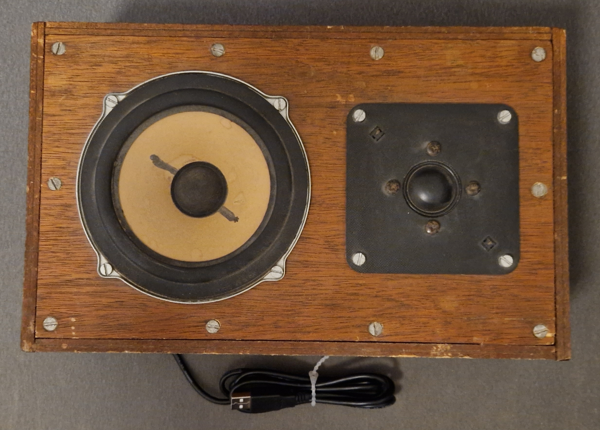
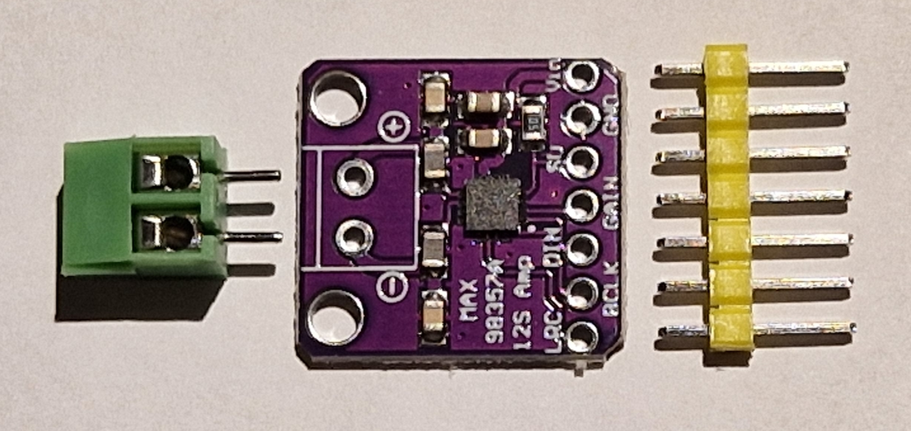
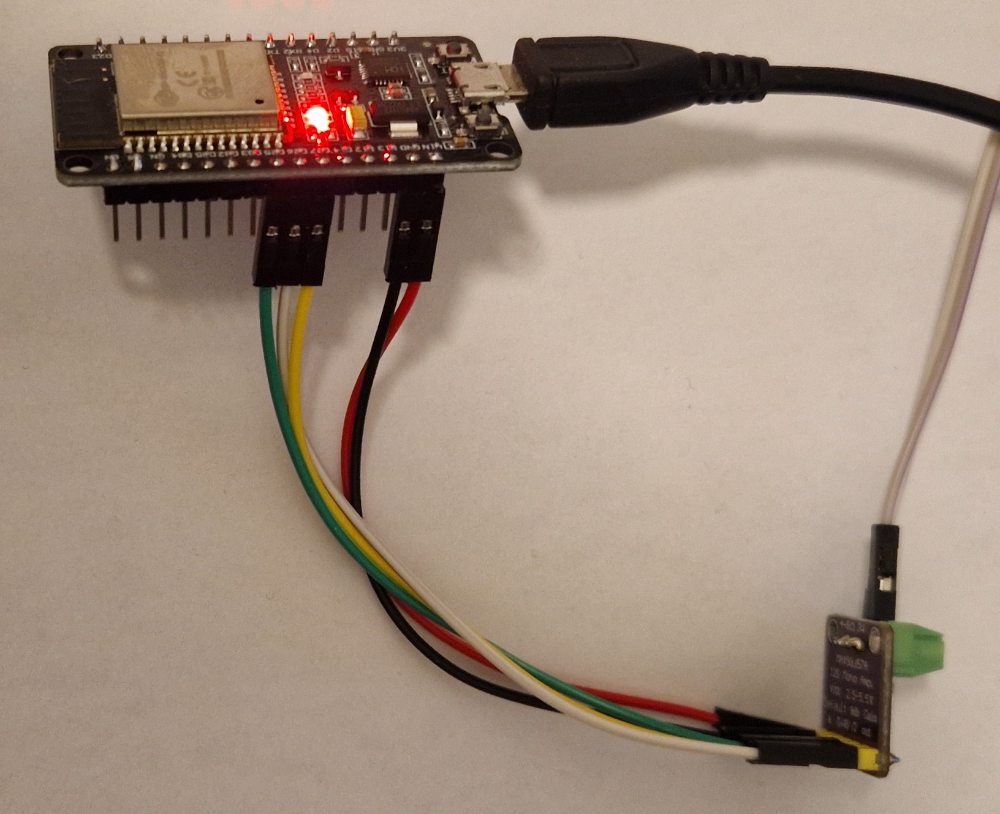
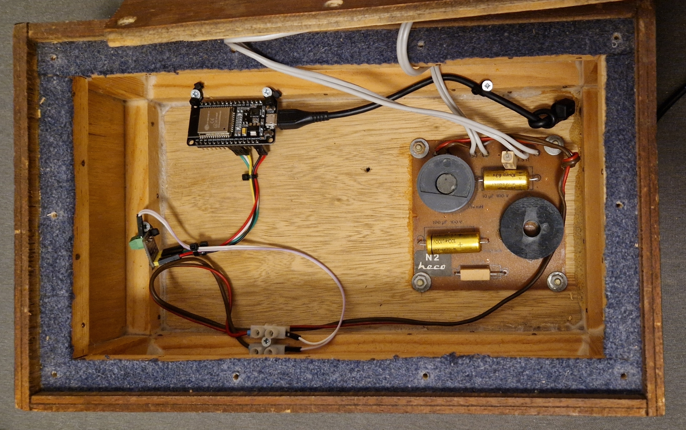

# MAX98357 Media Player

How to build a **WiFi connected mono loudspeaker (aka: media player)** with an ESP32, a MAX98357 and a speaker.

*State (2023.04): Speaker works and the sound quality is good. Works fine for radio and text-to-speech, but probably not as a "party boombox". Sometimes looses connection to home assistant, need to find out why ...*


*My 30+ year old Heco box -> my new Wifi connected and USB powered media player*

## ESPHome Media Player

With an ESP32 (ESP8266 will not work!), a cheap MAX98357 (I2S DAC & amplifier chip) and a common loudspeaker you can build a simple media player for Home assistant. Read: A WiFi connected loudspeaker. 

Media player basics: https://esphome.io/components/media_player/index.html#

---------------------
## Hardware
### I2S

I2S "Inter-IC Sound" https://en.wikipedia.org/wiki/I%C2%B2S is used to connect the ESP32 microcontroller with audio chips. I2S is available on the ESP32 only, an ESP8266 won't work.

The ESPHome "I2S Audio Media Player" https://esphome.io/components/media_player/i2s_audio.html can use different I2S chips (e.g. MAX98357, NS4168 or UDA1334A), I've used an easily available MAX98357.

All these chips contain a DAC https://en.wikipedia.org/wiki/Digital-to-analog_converter; a class D amplifier https://en.wikipedia.org/wiki/Class-D_amplifier and some other components in a single chip. 

The ESP32 internal DAC (8 bit) seems a bit noisy: https://community.home-assistant.io/t/esphome-i2s-media-player-internal-dac/434280 so this was not an option for me.

### MAX98357 Board

MAX98357: 

* I2S DAC and class D mono amplifier
* Output Power: 3.2W (4 Ω, 5V)
* Output Power: 1.4W (8 Ω, 5V)
* Supply Voltage: 2.5V to 5.5V

Datasheet: https://www.analog.com/media/en/technical-documentation/data-sheets/MAX98357A-MAX98357B.pdf

Aliexpress: Board with "connectors" ~3€ (2023.02)


*MAX98357 board*

https://circuitdigest.com/microcontroller-projects/esp32-based-internet-radio-using-max98357a-i2s-amplifier-board

Connect the MAX98357 to an ESP32 board:

| MAX | color | ESP |
| --- | --- | --- |
| 5V | red | 5V |
| GND | black | GND |
| SD | - | - |
| GAIN | - | - |
| DIN | green | 25 |
| BCLK | yellow | 27 |
| LRC | white | 26 |

The board defaults to mono (sum of left and right). It can be set to "left only" or "right only" with the SD pin. The gain can be adjusted with the GAIN pin. However, I haven't done experiments with those pins. More information how to use these pins can be found in the datasheet. 


*ESP32 and MAX98357 boards connected - USB 5V powered - grey and white wires towards the loudspeaker*

### Power Supply

I supply the ESP32 with 5V from a small USB power adapter (phone charger) and connect the ESP32 5V pins with the MAX board (red and black wires).

As I'm using the box for "low volume" radio and alike, this works just fine. However, I haven't tested this as a "party boombox" ;-)

### The box
I had an old unused set of Heco boxes (4Ω) around that I've bought already used 30+ years ago. They served me well for car stereo in my very first car - a [Renault 12](https://en.wikipedia.org/wiki/Renault_12). 

Integrating the electronics was quite easy, the parts are held in place with some wood screws and zip ties, the not shown damping mat avoids any rattling ...


*Inside the box "DIY style"*

------

## Software
### ESPHome Code

https://esphome.io/components/media_player/i2s_audio.html

```
media_player:
  - platform: i2s_audio
    name: ESPHome I2S Media Player
    dac_type: external
    i2s_dout_pin: GPIO25
    i2s_bclk_pin: GPIO27
    i2s_lrclk_pin: GPIO26
    mode: mono
```

Be careful to use the correct pin numbers. I'm using a nodemcu board, the pin numbering on other ESP32 boards may differ.

### Home Assistant

Once the ESP32 is set up and powered on, the "ESPHome I2S Media Player" simply appears in Home Assistant.

Obviously, you need to have the ESPHome integration installed.
