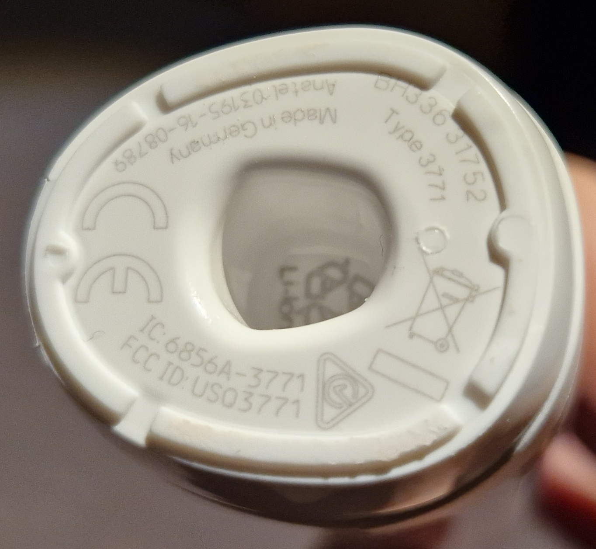

# Oral-B Genius X

A toothbrush with Bluetooth

*State (2023.11): Home Assistant Oral-B integration works fine and automatically reminds me twice a day ...*


*Oral-B Genius X white*

Features:
* Model: Oral-B Genius X (Type: 3771)
* Functions: 6 cleaning modes, SmartRing, AI, ... (well, I don't really care)
* Battery: Integrated Li-Ion
* Protocol: Bluetooth
* Power: Oral-B cordless power adapter
* Dimensions: 202x34x29 mm (without brush head)

Infos:
* https://www.service.oralb.com/us/en/products/3771/
* https://www.home-assistant.io/integrations/oralb/ (with list of supported models)
* https://www.youtube.com/watch?v=pFPX-MPycm8 (Automation Ideas)


eBay: 79 € (2023.11)

--------

## Why?

I often can't remember if I already brushed my teeth or not. Trying to write this down on paper or such was just annoying. Therefore I thought to buy a toothbrush with Bluetooth, so Home Assistant can remember me automatically that it's time to do the job again.

Home Assistant provides an Oral-B integration and I'm satisfied with my former Oral-B models. So I looked for the cheapest model supported by that integration, which is the Genius X.

## Usage

Hopefully you know how to use a toothbrush, I won't get into details ;-)

### Bluetooth Pairing

With Home Assistant, the Bluetooth and Oral-B integrations must be set up first (see below). After that, the connection is established instantly, there is no need for a Bluetooth pairing. Maybe the toothbrush uses Bluetooth Low Energy (BLE)?

### Power Consumption

Power consumption of the charger (aka: The brush stand):

* Without toothbrush: 0.2 W
* With toothbrush "full": 0.2 W
* With toothbrush "charging": 0.6 W

The toothbrush uses the same cordless power adapter as my former (cheaper) Oral-B toothbrushes also used. It has already shown that it's really practical.


*Oral-B Charger*

### Range

I haven't checked the Bluetooth range, but had no issues so far.

--------

## Home Assistant

https://www.home-assistant.io/integrations/oralb/

### Bluetooth

Setup Bluetooth support (Bluetooth integration or Bluetooth proxy) in Home Assistant first. I'm using an ESP32/ESPHome based Bluetooth proxy that works just fine.


* https://www.home-assistant.io/integrations/bluetooth/ Home Assistant Bluetooth integration
* https://esphome.io/projects/?type=bluetooth ESPHome Bluetooth proxy

### Oral-B

When adding the Oral-B integration (Settings > Devices & Services > Add Integration > Oral-B), it automatically scans for Oral-B toothbrushes. It found mine immediately, and after some simple clicks Home Assistant was ready to go.

As a start I created an entities card that shows all available data from the toothbrush:

```
type: entities
title: Genius X
entities:
  - entity: sensor.genius_x_4ade_pressure
    name: Pressure
  - entity: sensor.genius_x_4ade_time
    name: Time
  - entity: sensor.genius_x_4ade_toothbrush_state
    name: Toothbrush State
  - entity: sensor.genius_x_4ade_battery
    name: Battery
  - entity: sensor.genius_x_4ade_mode
    name: Mode
  - entity: sensor.genius_x_4ade_number_of_sectors
    name: Number of sectors
  - entity: sensor.genius_x_4ade_sector
    name: Sector
```
*Entities card showing all data from the Genius X*


*Home Assistant entities card while toothbrush is off*


*Home Assistant entities card while toothbrush is running*

The "Toothbrush State" becoming "idle" or "running" was the most interesting entity when I started to automate things ...

-------------------------

## Conclusion

The hardest part was to set up Bluetooth support for Home Assistant. The setup of the toothbrush itself was really easy. As a bonus, the data from the toothbrush is recognized by Home Assistant almost instantly.

Is it worth spending 80€ for a smart toothbrush? Well, time will tell if it helps me or not ...

## Images


*Battery full, Bluetooth enabled*


*With a brush head*


*The bottom with some "technical data"*
