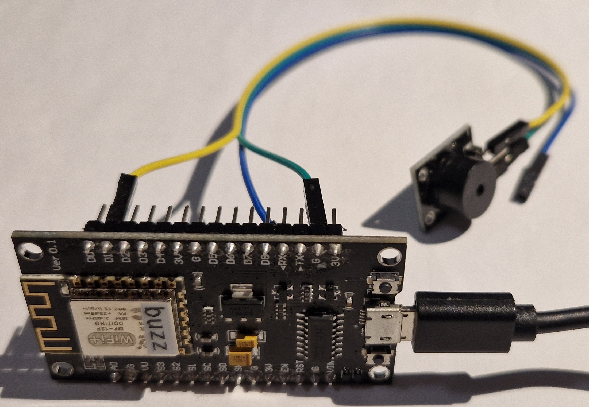
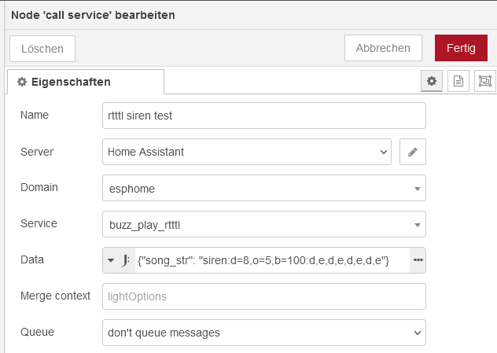

# RTTTL Buzzer

Play simple RTTTL "songs" using a passive piezo buzzer

*State (2023.12): I'm not using RTTTL any longer as the beeps are a bit annoying, but TTS (Text To Speech) instead*


*Small piezo buzzer PCB connected to an ESP8266 board with two wires*

Features:
* Function: Play various RTTTL (Ring Tone Text Transfer Language) "songs" with a piezo buzzer
* Dimensions (PCB): 19x15x11 mm
* Interface(s): Pin D1
* Supply voltage: -
* Maximum current: -

Aliexpress: 1 € (2023.12)

Additional info links:
* https://esphome.io/components/rtttl.html
* https://en.wikipedia.org/wiki/Ring_Tone_Text_Transfer_Language

--------

## Hardware

There are active and passive buzzers available. Active buzzers have a small circuit to create a fixed frequency and must be provided e.g. with 3.3 V DC. Passive buzzers act more like a traditional loudspeaker and must be provided by a frequency. You can't detect the buzzer type by looking at it!

For RTTTL you'll need a passive buzzer.

If the buzzer starts buzzing if you connect 3.3 V DC to it, its an active one which cannot be used for RTTTL.

### Bill of Material

* ESP8266 "nodemcuv2"
* passive(!) buzzer
* two short wires
* power supply: e.g. USB micro cable and power adapter

Probably any ESP8266 board should work. Using an ESP32 may required minor changes in the ESPHome config.

### Connections

| ESP | buzzer |
| --- | --- |
| D1 | S |
| GND | - |

Markings on the buzzer PCB may vary ...

### Power Supply & Consumption

The passive buzzer is directly connected to the I/O pin D1 and needs no further power supply.

--------

## ESPHome

https://esphome.io/components/rtttl.html

The following ESPHome snippet creates a "play_rtttl" service which plays the RTTTL "song" provided by the variable song_str. This can be easily triggered by a Home Assistant Automation or Node-Red:

```
esphome:
  name: "buzz"

...

output:
  - platform: esp8266_pwm
    pin: D1
    id: rtttl_out

rtttl:
  output: rtttl_out
  on_finished_playback:
    - logger.log: 'Song ended!'

api:
  services:
    - service: play_rtttl
      variables:
        song_str: string
      then:
        - rtttl.play:
            rtttl: !lambda 'return song_str;'
```

Be careful to avoid multiple "api" keys!

After download, the service should be available as "play_rtttl" on the ESP "buzz".

## Home Assistant

To play RTTTL songs, the service *esphome.buzz_play_rtttl* can be called in Home Assistant now.

An example Automation yaml snippet playing a short "siren song":

```
alias: rtttl test
description: ""
trigger: []
condition: []
action:
  - service: esphome.buzz_play_rtttl
    data:
      song_str: siren:d=8,o=5,b=100:d,e,d,e,d,e,d,e
mode: single
```

## Node-Red

... and the same using Node-Red:


*Node-Red "call service" of the esphome service buzz_play_rtttl*

-------------------------

## Conclusion

The rtttl buzzer is cheap and quick to set up. I've used it a while for notifications. However, over time that beeping can become annoying. Currently I'm using TTS for such notifications.
