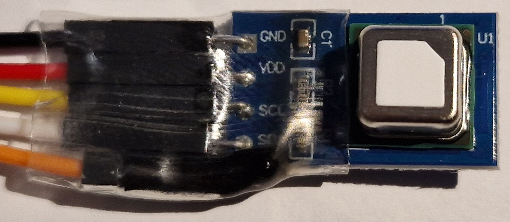
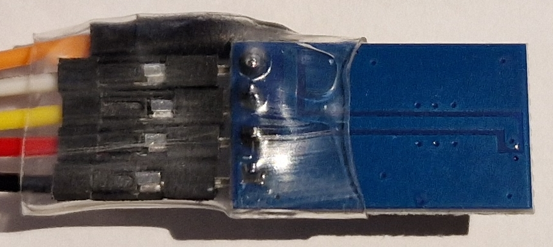

# Sensirion SCD41

**Sensor of CO2**, Temperature and Humidity with I2C interface

*State (2023.12): The SCD41 is a "real" CO2 sensor which is working well. Calibration can be a bit tricky (as with other CO2 sensors)*


*SCD41 board with connection wires (the orange wire is not connected)*

Technical data:

* Model: Sensirion SCD41
* Functions: CO2, temperature and humidity sensor
* Measured CO2 range: 400~5000 ppm (accuracy: +-(50ppm +2.5-5% of reading), resolution: 1 ppm)
* Measured temperature range: -10~60°C (accuracy: +-0.8°C, resolution: 0.01°C)
* Measured humidity range: 0~100% RH (accuracy: +-6% RH, resolution: 0.01% RH)
* Dimensions (PCB): 23x13x8 mm
* Interface: I2C
* I2C address: 0x62
* Supply voltage: 2.4~5.5 V
* Maximum current: 205 mA (peak), 18 mA (average)

For detailed infos about the SCD41 accuracy, see the datasheet:
https://sensirion.com/media/documents/48C4B7FB/6426E14D/CD_DS_SCD40_SCD41_Datasheet_D1_052023.pdf

More infos:
* https://emariete.com/en/sensor-co2-sensirion-scd40-scd41/

Aliexpress: 20 € (2023.12)

--------

### CO2 Values

Why measuring CO2 and what does the measured values mean?

Humans consume oxygen and produce CO2 (beside other things). Without ventilation, breathing humans raise the CO2 level in a room up to the point where people gets dizzy and fatique - or worse. With a single person in a large room this will take several hours or longer, with a lot of persons in a small badly ventilated conference room this can happen real quick. By measuring the CO2 level, the "freshness" of the air can be measured.

So the CO2 level is a very good indicator when its time to improve the ventilation (aka: open the windows). Of course, other indicators (e.g. humidity) should also be considered.

I found slightly varying definitions of the "air quality index" of indoor CO2 values. I'm using the following definition for my own orientation:

| | AQI | CO2 (ppm) |
| --- | --- | --- |
| Good | 0-50 | 400-1000 |
| Moderate | 51-100 | 1001-1500 |
| Unhealthy (sensitive) | 101-150 | 1501-2000 |
| Unhealthy | 151-200 | 2001-2500 |
| Very Unhealthy | 201-300 | 2501-5000 |
| Hazardous | 301-500 | 5001-15000 |

I try to avoid getting beyond the "Moderate" level of 1500 ppm ...

In my medium sized bedroom, the following CO2 values are the "typical bandwidth":

420 ppm: Outside "fresh air" rushing in (ppms won't get any lower than this)
600 ppm: Well ventilated bedroom (at least in winter time)
1600 ppm: Bedroom in desperate need of fresh air

--------

## Hardware

### CO2 Sensor Selection

The SCD41 is a "Photoacoustic NDIR sensor" which actually measures the CO2 concentration.

Hint: Some cheap "fake" CO2 sensors (like the ams CCS811) try to "calculate" the CO2 value from other measured values, which doesn't really work. As an example, the so called eCO2 value from a Sensirion SGP30 is practically unusable for me.

Comparing the available "real" CO2 sensors (Sensirion SCDxx, Amphenol/Teluire T6xxx, Winsen MH-Z19x, SenseAir S8, ...), the SCD41 seems to be a good sensor considering the price/performance. However, the price/performance ratio is close between these sensors - you get what you pay for.

### Bill of Material

Beside the SCD41 on a breakout board, I'm using an ESP 8266 based "D1 mini" board. Other ESP 8266 or ESP 32 boards should work as well.

* SCD41 on breakout board
* ESP 8266 "D1 mini" or alike
* some jumper wires
* power supply: e.g. USB micro cable and power adapter

### Connections

Connections from the "D1 mini" to the SCD41:

| D1 mini | SCD41 |
| --- | --- |
| GND | GND |
| 3V3 | VCC |
| D1 | SCL |
| D2 | SDA |

### Power Supply & Consumption

The SCD41 takes up to 205 mA (peak) and can be powered by the 3.3V from the D1 mini (or similiar) boards. Using 5V would also be possible.

--------

## ESPHome

https://esphome.io/components/sensor/scd4x.html

```
...

# I2C
# https://esphome.io/components/i2c
# a D1 mini is used here
i2c:
  sda: GPIO4 # D2
  scl: GPIO5 # D1

# SCD41
# https://esphome.io/components/sensor/scd4x.html
  - platform: scd4x
    temperature_offset: 5.5
    altitude_compensation: 309m
    co2:
      name: "SCD41 CO2"
    temperature:
      name: "SCD41 Temperature"
    humidity:
      name: "SCD41 Humidity"
```

Just a quick overview of the calibration settings I use, further explanations will follow in the "Calibration" section below.

The *temperature_offset* of 5.5°C (default is 4°C) was determined by comparing the SCD41 temp value with measured values from other sensors. After I've adjusted the temperature_offset, the measured humidity values also changed for the better.

The "altitude_compensation" of 309m is the elevation of Nürnberg.

## Home Assistant

```
TODO: code snippet 
```

TODO: Screenshot 

-------------------------

## Calibration

A proper calibration is necessary for accurate results. A lot of information about the SCD41 sensor calibration can be found in the datasheet in section 3.6: "On-Chip Output Signal Compensation"

For reference: I've done the following SCD41 calibrations without any sensor casing, in a room of about 20°C and 60% RH over a period of a few days.

Well, calibrations are only as good as the references used ...

### Temperature References

My "temperature references" were:

| Device | Sensor | Temperature accuracy (typ.) | Example Measurement | Running for ... |
|--- | --- | --- | --- | --- |
| Xiaomi LYWSD03MMC | Sensirion SHTV3 | +-0.2 °C | 20.18 "C | about a year |
| Acara WSDCGQ11LM | Sensirion SHT30 | +-0.2 °C | 20.94 °C | about a year |
| DIY with ESP8266 | Sensirion SHT31 | +-0.2 °C | 20.5 °C | a few days |

A few thoughts what to expect from the datasheet specifications vs. the real world:

As the temperature "typical accuracies" of the sensors are +-0.2 °C, one could expect a maximum value difference of 0.4 °C (one sensor has an error of +0.2 °C, another -0.2 °C). However, the actual difference between min. (20.18 °C) and max. (20.94 °C) of the example measurement (taken at the same time and circumstances) is 0.76 °C. Causes may be the casings, firmware problems, long term drift, the sensors aren't as good as the specs - or I just got chinese knockoffs.

While the typical accuracy of the Sensirion sensors in use is +-0.2 °C, the maximum accuracy is +-0.4 °C. The measured 0.76 °C difference would fit in the maximum range of 0.8 °C.

However, the SCD41 has a typical accuracy of +-0.8 °C and real life is even worse, the above should be good enough for a reasonable temperature calibration.

### CO2 References

Outside "fresh air" has a CO2 concentration slightly above 400 ppm. The ESPHome SCD41 page mentions 419 ppm for April 2022 and https://www.co2.earth/daily-co2 lists 422 ppm for December 2023. This can be used as a suitable CO2 reference gas.

As another "reference", I'm using my "AirCO2ntrol Mini" (which is a rebadged "ZyAura ZGm053U"). It is running since 2018 with auto calibration. While it shows reasonable CO2 values since 2018, I'm unsure about the "reference quality" of it ...

| Device / Model | Sensor | CO2 accuracy (typ.?) | Running ... |
|--- | --- | --- | --- |
| TFA Dostmann AirCO2ntrol Mini | unknown | ±100ppm or ±7% of reading, whichever is greater | since 2018 |

### Temperature (and Humidity) Calibration

Hint: Calibrating the temperature is NOT needed for the CO2 measurements!

The SCD41 has a specified typical temperature accuracy of +-0.8°C (@15-35 °C), a repeatability of +-0.1°C and a response time of 120s. Interestingly, no maximum accuracy is specified!

After running the SCD41 for a day or two, the curve shapes in Home Assistant looked similiar between the "Sensirion SHT references", but the SCD41 showed permanently about  1.5°C too much. Adjusting the "temperature_offset" in ESPHome from the default 4.0°C to 5.5°C brought it much closer to the SHT31, which is the best temperature reference I currently own.

TODO: Add the difference between SCD41 and SHT31 after a few more days
TODO: Add the difference between SCD41 and SHT45

Hint: Calibrating the temperature will noticeably affect the humidity readings as well. Raising the "temperature_offset" by 1°C (4.5 to 5.5 °C) resulted in a ~3% RH raise.

### Pressure / Height Calibration

From the SCD41 datasheet: "Feeding the SCD4x with the pressure or altitude enables highest accuracy of the CO2 output signal across a large pressure range"

With ESPHome you have three calibration options to choose from:

* set a static altitude
* set a static pressure
* set a dynamic pressure using ESPHome lambdas (e.g. from a BMP280 sensor)

If I would use the sensor "mobile" especially in changing elevations, I would choose the last option.

For simplicity reasons, I'm using the first option. In ESPHome I've added: "altitude_compensation: 309m". I got "my" elevation of 309 m from the Wikipedia page of Nürnberg.

For more details about the pressure / height calibrations have a look at the ESPHome SCD41 page and the datasheet.

### CO2 Calibration

At the start I compared the measured values with my "AirCO2ntrol Mini", I saw a more or less constant offset of around 300 ppm (the Mini always showed less), which I expected to be a calibration issue.

#### CO2 Automatic Self Calibration (ASC)

Hint: ASC is enabled by default.

What these (ASC and other similiar) algorithms automatically do: Look for the lowest measured value of the last few days, expect this to be outside air with 400 ppm and set the calibration accordingly. However, from the SCD41 datasheet: "The ASC algorithm assumes that the sensor is exposed to air with CO2 concentrations of 400 ppm at least once per week". So obviously the ASC will "fail", if the sensor had no contact to fresh air over the last days - the "faulty" ASC calibration will cause the provided CO2 values to be (much) too low.

In fact a day or two after initial setup, the SCD41 values suddenly dropped by ~350 ppm without an obvious external cause (I was sleeping at that time and there was no atmospheric pressure change). I expect this drop to be caused by an SCD41 automatic self calibration. After this "event", the "AirCO2ntrol Mini" constantly shows ~100 ppm more than the SCD41 (before it was 300 ppm less). I'm curious when the "next drop" will happen.

This highlights another disadvantage of the ASC: The values will (suddenly) change without a notification.

TODO: Is there a way to retrieve the current calibration value(s), so an auto calibration event can at least be noticed?

#### CO2 Forced Recalibration (FRC)

During a (manually) forced recalibration, the sensor must be provided with a known CO2 reference gas (fresh air) and then an I2C command must be issued to the SCD41 that tells the sensor the new reference value (e.g. 419 ppm).

When switching off ASC and doing the FRC regularly, this avoids the drawback of unexpected CO2 value changes caused by an unnoticed ASC run.

However, when ASC is off and FRC is "forgotten", the CO2 values will probably "slowly drift away". Unfortunately, I couldn't find information how long the sensor will provide reasonable CO2 values without any recalibration. The weekly interval of the ASC gives at least a hint that its not very long.

Detailed instructions for the FRC procedure can be found in the SCD41 datasheet at section 3.7.1: "perform_forced_recalibration"

TODO: I'm curious what the effects of a proper "fresh air FRC" later on will be.

-------------------------

## Conclusion

The SCD41 is a "proper" CO2 sensor that returns reasonable results (unlike the cheap "eCO2" sensors). If I open a window for fresh air, the measured CO2 values drop noticeably. Compared with my "AirCO2ntrol Mini", the returned values look reasonably close.

Most CO2 sensors need proper calibration, I have to do some further experiments here.

Measuring CO2 is the main purpose of this sensor. The accuracy of the temperature and humidity measurements aren't very good, especially without calibration. If you need proper temp&hum measurements, an SHT40, SHT41 or an even better SHT45 will provide more accurate results without the need for calibration.

-------------------------

## Images


*Back of the SCD41 board without any components*
