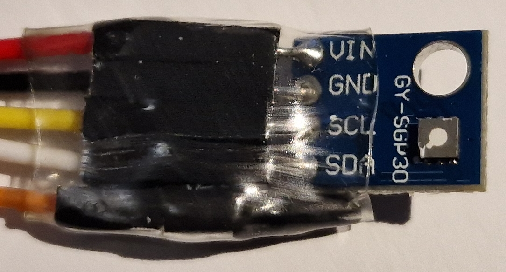
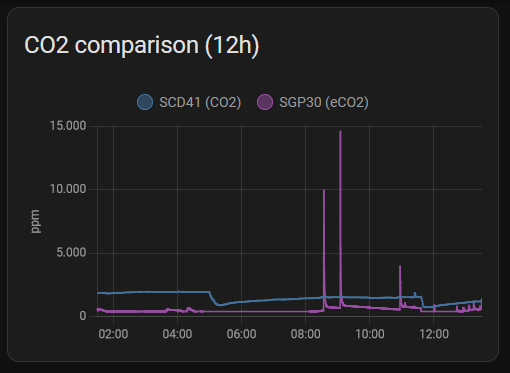
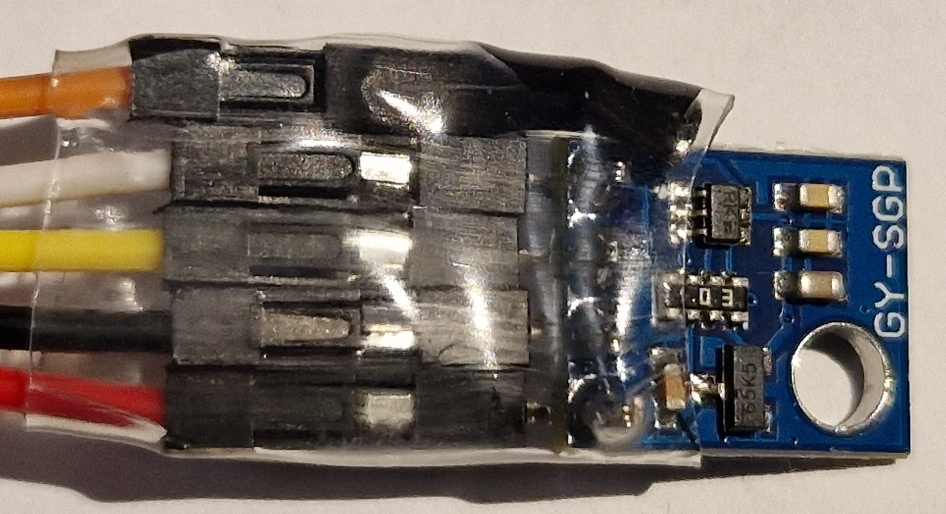

# Sensirion SGP30

**Sensor for TVOC** (Total Volatile Organic Compounds) and "eCO2" (equivalent CO2) with I2C interface

*State (2023.12): While the eCO2 measurement is useless, the TVOC may provide some information. Further experiments needed ...*


*SGP30 board with connection wires (the orange wire is not connected)*

Technical data:
* Model: Sensirion SGP30
* Functions: The Sensor calculates TVOC and eCO2, actually measured values are Ethanol and H2 (Hydrogen)
* Measured Ethanol range: 0~1000 ppm (accuracy: typ.: 15% of meas. value, resolution: 0.2 % of meas. value)
* Measured H2 range: 0~1000 ppm (accuracy: typ.: 10% of meas. value, resolution: 0.2 % of meas. value)
* Calculated TVOC range: 0~60000 ppb (accuracy: not specified, resolution: 1/6/32 ppb)
* Calculated eCO2 range: 400~60000 ppm (accuracy: not specified, resolution: 1/3/9/31 ppm)
* Dimensions (PCB): 14x11x4 mm
* Interface: I2C
* I2C address: 0x58
* Supply voltage: PCB: 1.8~5V (Sensor: 1.62~1.98 V)
* Maximum current: 48.8 mA

For detailed infos about the SCD41 accuracy and resolution, see the datasheet: https://sensirion.com/media/documents/984E0DD5/61644B8B/Sensirion_Gas_Sensors_Datasheet_SGP30.pdf

Aliexpress: 7 € (2023.12)

--------

### Measurement details

I had to read the datasheet twice to understand what the SGP30 sensor is actually doing. Seems that H2 (Hydrogen) and Ethanol are the raw signals that are actually measured. Based on these sensor signals a total VOC signal (TVOC) and a CO2 equivalent signal (CO2eq) are calculated.

The specified typical accuracy of 15% (Ethanol) and 10% (H2) indicates this sensor is more a "guessing game" than a real measuring device.

#### TVOC

The TVOC (Total Volatile Organic Compounds: https://en.wikipedia.org/wiki/Volatile_organic_compound) concentration can be "caused" by many different substances. As the sensor only reacts on Ethanol and H2, many others will not affect the measured values - which seems to be a typical "problem" of other TVOC sensors as well.

#### (e)CO2

The "equivalent CO2" calculated value (called eCO2 or CO2eq) is known to be useless. I've compared the measured values with "real" CO2 sensors (Sensirion SCD41 and "TFA Dostmann AirCO2ntrol mini"), there is no real correlation of the measured values at all.


*Comparing measured values of SCD41 (CO2) and SGP30 (eCO2) over a period of 12 hours*

Interestingly, the successor model SGP41 dropped the eCO2 value completely and provides a probably more useful NO2 measurement instead.

--------

## Hardware

### Bill of Material

Beside the SGP30 on a breakout board, I'm using an ESP 8266 based "D1 mini" board. Other ESP 8266 or ESP 32 boards should work as well.

* SGP30 on breakout board
* ESP 8266 "D1 mini" or alike
* some jumper wires
* power supply: e.g. USB micro cable and power adapter

### Connections

Connections from the "D1 mini" to the SGP30:

| D1 mini | SGP30 |
| --- | --- |
| GND | GND |
| 3V3 | VCC |
| D1 | SCL |
| D2 | SDA |

### Power Supply & Consumption

The SGP30 breakout board contains a voltage regulator which can be supplied with 1.8~5V (the sensor itself is internally supplied with 1.8V). The maximum current is 48.8 mA (peak). I'm using the 3.3V supply from the D1 mini without problems, 5V should also work.

--------

## ESPHome

https://esphome.io/components/sensor/sgp30.html

```
...

# I2C
# https://esphome.io/components/i2c
# a D1 mini is used here
i2c:
  sda: GPIO4 # D2
  scl: GPIO5 # D1

# SGP30
# https://esphome.io/components/sensor/sgp30.html
# avoid sending every 1s: https://community.home-assistant.io/t/esphome-sgp30-sensor-filters-not-working/345425
  - platform: sgp30
    eco2:
      name: "SGP30 eCO2"
      accuracy_decimals: 1
      filters:
        - sliding_window_moving_average:
            window_size: 10
            send_every: 10
    tvoc:
      name: "SGP30 TVOC"
      accuracy_decimals: 1
      filters:
        - sliding_window_moving_average:
            window_size: 10
            send_every: 10
    store_baseline: yes
    address: 0x58
    update_interval: 1s
```

If the *update_interval* setting isn't 1s, a warning appears in the ESP logs. Unfortunately, even the source code provides no further explanation why such a high rate is needed. I kept the 1s rate but wanted to avoid such a "nervous data flood". Therefore I've added a "sliding_window_moving_average" filter that averages and provides a new value every 10s.

## Home Assistant

```
TODO: code snippet
```

TODO: Screenshot

-------------------------

## Conclusion

The SGP30 measures Ethanol and Hydrogen with an accuracy of 15%/10% and then applies "calculation magic" to provide TVOC and eCO2 values. While I consider the eCO2 to be completely useless, some more experiments are needed to find out if the TVOC measurement with such a low accuracy proves to be useful.

## Images


*Back side of the SGP30 board with auxiliary components (voltage regulator?) and connection wires (the orange wire is not connected)*
