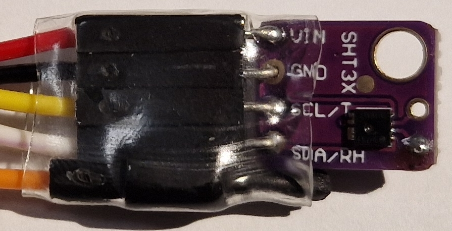
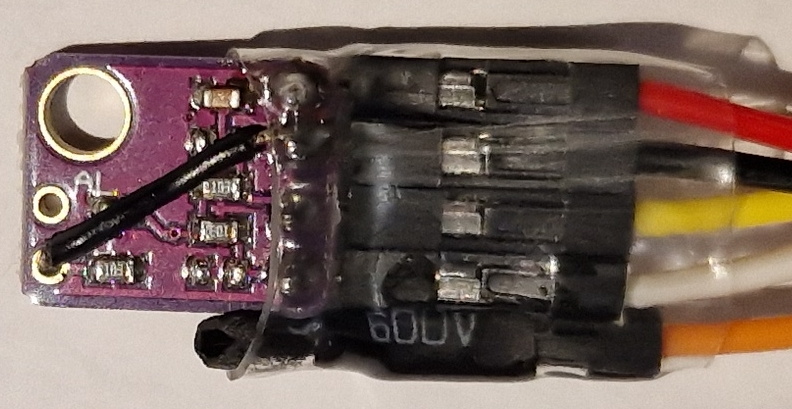

# Sensirion SHT31

Cheap temperature and humidity sensor with I2C interface

*State (2023.12): Working just fine with ESPHome / Home Assistant. However, more accurate successor model series SHT4x are already available for a similar price*


*SHT31 board with connection wires (the orange wire is not connected)*

Technical data:
* Model: Sensirion SHT31
* Functions: Temperature and humidity sensor
* Measured temperature range: -40~125°C (accuracy: typ. +-0.2°C @0~90°C / max. +-0.4°C @-40~90°C, resolution: 0.1°C)
* Measured humidity range: 0~100% (accuracy: typ. +-2% / max. +-2.5% @0~90%, resolution: 0.1%)
* Dimensions (PCB): 13x10.5x3 mm
* Interface: I2C
* I2C address: 0x44 (optional: 0x45)
* Supply voltage: 2.15 to 5.5 V
* Maximum current: 1,5 mA (600 µA typ.)

Link to Datasheet: https://sensirion.com/media/documents/213E6A3B/63A5A569/Datasheet_SHT3x_DIS.pdf

Aliexpress: ~2 € (2023.12)

--------

## Hardware

### Bill of Material

Beside the SHT31 on a breakout board, I'm using an ESP 8266 based "D1 mini" board. Other ESP 8266 or ESP 32 boards should work as well.

* SHT31 on breakout board
* ESP 8266 "D1 mini" or alike
* some jumper wires
* power supply: e.g. USB micro cable and power adapter

### Connections

Connections from the "D1 mini" to the SHT31:

| D1 mini | SHT31 |
| --- | --- |
| GND | GND |
| 3V3 | VCC |
| D1 | SCL |
| D2 | SDA |

It's important to connect the "AD" pin on the board (from the datasheet: "do not leave floating"). The default is to connect AD to GND for I2C address 0x44. If AD is connected to VCC, the I2C address is 0x45


*SHT31 board (back) with a short black wire from AD to GND for I2C address 0x44*

There is also an alarm output AL (ALERT) pin which I haven't used.

### Pull-up Resistors

The breakout board includes two 10k pull-up resistors (marked "103") for SCL and SDA which are not necessary, as the ESP8266 controller already has internal pull-up resistors. If too many boards are connected that have such pull-up resistors, you may encounter I2C communication problems. In this case you can remove these resistors on the SHT31 board. However, my setup is working fine ...

### Power Supply & Consumption

The SHT31 takes only 1,5 mA (max.) and can easily be powered by the 3.3V from the D1 mini (or similar) boards. Using 5V would also be possible.

--------

## ESPHome

https://esphome.io/components/sensor/sht3xd.html

```
...

# I2C
# https://esphome.io/components/i2c
# a D1 mini is used here
i2c:
  sda: GPIO4 # D2
  scl: GPIO5 # D1

# SHT31
# https://esphome.io/components/sensor/sht3xd.html
sensor:
  - platform: sht3xd
    temperature:
      name: "SHT31 Temperature"
    humidity:
      name: "SHT31 Humidity"
    address: 0x44
    update_interval: 10s
```

## Home Assistant

```
TODO: code snippet 
```

TODO: Screenshot 

-------------------------

## Conclusion

Without a calibrated thermometer / hygrometer its hard to tell if the SHT31 measurements are accurate. Comparing the SHT31 with the Xiaomi devices I own, the SHT31 "constantly" shows around 0.2 °C and 2% RH less - which is within the tolerances of the devices.

But, the SHT31 reacts much quicker to changes of temperature / humidity compared to the Bluetooth / Zigbee connected Xiaomi devices. However, as I'm running the SHT31 sensor without any housing right now, this may change if its put in a case.

All in all, the output looks ok to me. As I bought the sensor already in 2020, the successors SHT4x (SHT41, SHT45, ...) with a better accuracy for a similar price may be a better option today.
