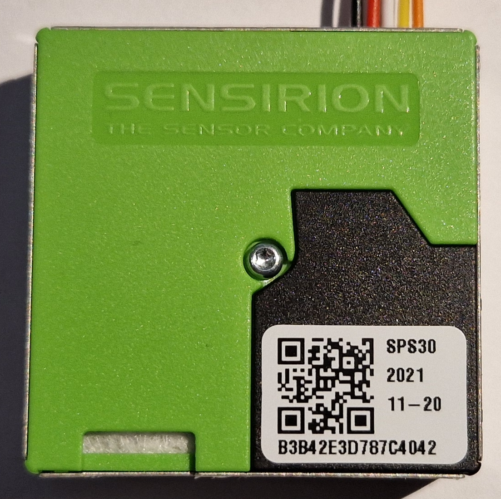
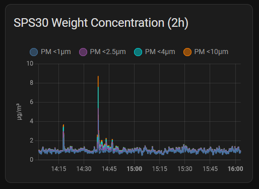
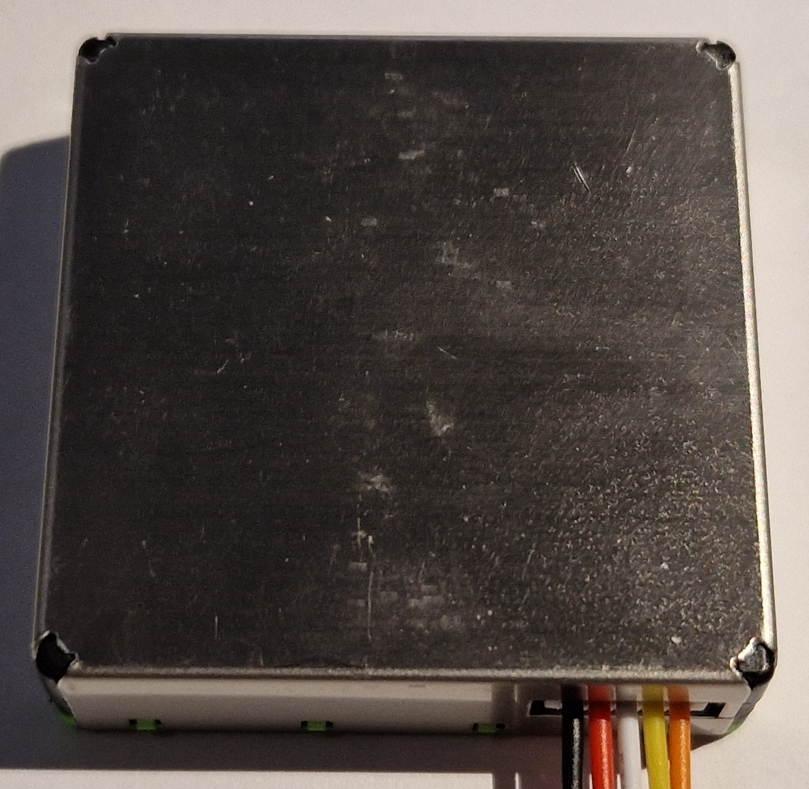

# Sensirion SPS30

Particulate matter **sensor for PM1, PM2.5, PM4 and PM10** with I2C and UART interfaces

*State (2023.12): SPS30 is working fine*


*Sensirion SPS30*

Technical data:
* Model: Sensirion SPS30
* Functions: Particulate Matter Sensor PM1, PM2.5, PM4 and PM10
* Measured PM1 & PM 2.5 range: 0~1000 μg/m3 (accuracy: +-10 μg/m3 / +-10 % m.v., resolution: 0.01 μg/m3)
* Measured PM4 & PM10 range: 0~1000 μg/m3 (accuracy: +-25 μg/m3 / +-25 % m.v., resolution: 0.01 μg/m3)
* Measures also PM number concentrations and typical particle size, see datasheet for details
* Dimensions: 41x41x12 mm
* Interfaces: I2C or UART (selectable with SEL pin)
* I2C address: 0x69
* Supply voltage: 4.5~5.5 V
* Maximum current: 80 mA (fan start)

Link to Datasheet:
https://sensirion.com/media/documents/8600FF88/616542B5/Sensirion_PM_Sensors_Datasheet_SPS30.pdf

Aliexpress: 25 € (2023.12)

--------

## Hardware

### Internal fan

The SPS30 contains a tiny fan to periodically remove dust. By default, its only running 10s each week, so it shouldn't be too annoying.

### Bill of Material

Beside the SPS30, I'm using an ESP 8266 based "D1 mini" board. Other ESP 8266 boards should work as well. The ESP32 is not 5V tolerant, an I2C level shifter would probably be required in this case.

* SPS30
* 5 pin JST ZH connector (1.5 mm pitch) with some wires (mine came with the sensor)
* ESP 8266 "D1 mini" or alike
* power supply: e.g. USB micro cable and power adapter for the "D1 mini"

### Connections

Connections from the "D1 mini" to the SPS30 using the I2C interface:

| D1 mini | SPS30 |
| --- | --- |
| 5V | VDD |
| D2 | SDA |
| D1 | SCL |
| GND | SEL |
| GND | GND |

Connecting SEL to ground sets the SPS30 to use the I2C interface. If the SEL line is left floating, the UART interface is used.

Hint: The datasheet provides a nice drawing of the connector pinout.

### Power Supply & Consumption

The SPS30 uses 5V with up to 80 mA when the internal cleaning fan is running. I'm using the 5V supply from the D1 mini.

--------

## ESPHome

https://esphome.io/components/sensor/sps30.html

```
...

# I2C
# https://esphome.io/components/i2c
# a D1 mini is used here
i2c:
  sda: GPIO4 # D2
  scl: GPIO5 # D1

# SPS30
# https://esphome.io/components/sensor/sps30.html
  - platform: sps30
    pm_1_0:
      name: "SPS30 PM <1µm Weight concentration"
      id: "SPS30_PM_1_0"
    pm_2_5:
      name: "SPS30 PM <2.5µm Weight concentration"
      id: "SPS30_PM_2_5"
    pm_4_0:
      name: "SPS30 PM <4µm Weight concentration"
      id: "SPS30_PM_4_0"
    pm_10_0:
      name: "SPS30 PM <10µm Weight concentration"
      id: "SPS30_PM_10_0"
    pmc_0_5:
      name: "SPS30 PM <0.5µm Number concentration"
      id: "SPS30_PMC_0_5"
    pmc_1_0:
      name: "SPS30 PM <1µm Number concentration"
      id: "SPS30_PMC_1_0"
    pmc_2_5:
      name: "SPS30 PM <2.5µm Number concentration"
      id: "SPS30_PMC_2_5"
    pmc_4_0:
      name: "SPS30 PM <4µm Number concentration"
      id: "SPS30_PMC_4_0"
    pmc_10_0:
      name: "SPS30 PM <10µm Number concentration"
      id: "SPS30_PMC_10_0"
    pm_size:
      name: "SPS30 Typical Particle size"
      id: "SPS30_PM_size"
    address: 0x69
    update_interval: 10s
```

The weight concentration of PM1, PM2.5, PM4 and PM10 are measured in μg/m3 and typically meant when e.g. PM2.5 or PM10 is mentioned. The *number concentration* in #/cm3 and *typical particle size* in μm are rarely seen elsewhere.

## Home Assistant

```
type: history-graph
title: SPS30 Weight Concentration (2h)
hours_to_show: 2
entities:
  - entity: sensor.air_sps30_pm_1_m_weight_concentration
    name: PM <1µm
  - entity: sensor.air_sps30_pm_2_5_m_weight_concentration
    name: PM <2.5µm
  - entity: sensor.air_sps30_pm_4_m_weight_concentration
    name: PM <4µm
  - entity: sensor.air_sps30_pm_10_m_weight_concentration
    name: PM <10µm
```


*Two hour history showing the four weight concentration PM values*

-------------------------

## Conclusion

The reported PM values seem to be reasonable to me, although the 10%/25% accuracy isn't very much. Other sensors in that price range have similar or lower specs (Sensirion SEN54, Cubic PM1006) or don't even provide accuracy infos at all (Plantower PMSxxxx, Nova Fitness SDS011).

I wasn't expecting high PM values (non-smoker, no open fireplace, no pets ...) which turned out to be true. In fact, when I open my windows for fresh air, the indoor PM values are slightly going up.

## Images


*Back side of Sensirion SPS30 with connector*
