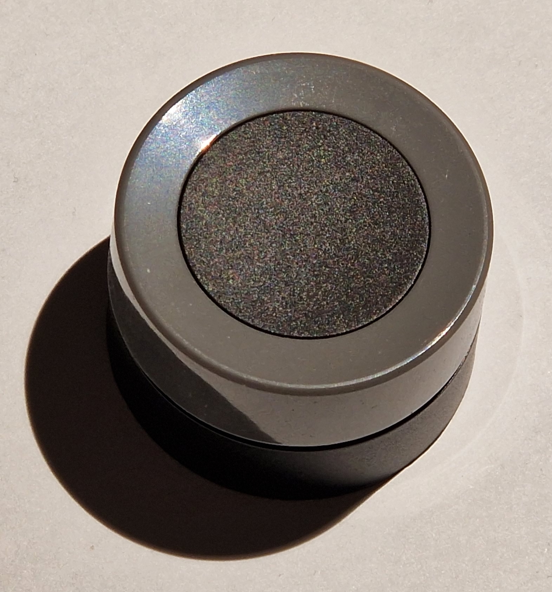
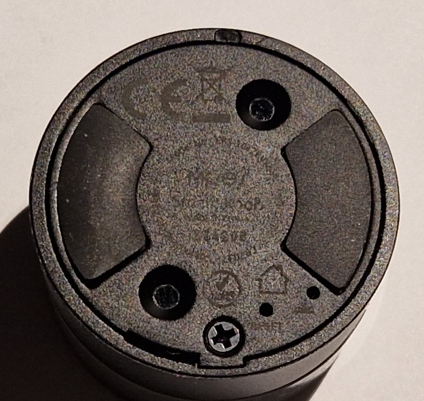

# TuYa Smart Knob

**Single button and rotary encoder over Zigbee**

*State (2023.04): Works good. Battery life may be an issue?*

*TuYa Smart Knob: The upper half can be pushed down, the grey ring can be turned*

Features:
* Model: Moes ERS-10TZBVK-AA
* Functions: Single Button and rotary encoder
* Protocol: Zigbee
* Battery: CR2032
* Dimensions: 40x40x26.5 mm

Aliexpress: ~14€ (2023.02)

Various discussions about the knob: https://community.home-assistant.io/t/zigbee2mqtt-tuya-moes-smart-knob-ers-10tzbvk-aa/419989

--------

## Usage

Button press (black center or center & ring):
* Single press
* Double press
* Triple press (internally used, not available over Zigbee)
* Hold

Turn the ring:
* Left
* Right
* Button hold & left
* Button hold & right

### Back Side

*Back side with the two very small holes (bottom right) for RESET and LED. The two rubber areas prevent slipping*

The LED will blink shortly on every action (push or turn).

### Join mode

The knob will be in Zigbee "join mode" at first start.

To trigger the "join mode" again: Push into the "RESET" hole at the back with a thin wire for a few seconds until LED blinks. If the LED stops blinking after a few seconds without any intervention or Zigbee joining, the battery may be low. Don't push the wire into the LED hole :-)

### Battery

Battery life: I had to replace the battery two months after first setup. Don't know if that was a bad battery or if the device "eats" batteries. Time will tell ...

Battery replacement: Remove screw, remove back lid, replace CR2032

After replacing the battery, the LED was flashing all the time and pressing "RESET" or enabling join mode in Zigbee2MQTT didn't help. I thought the knob just died. After I restarted Zigbee2MQTT the knob suddenly worked again.

------

## Zigbee2MQTT

The knob was automatically detected and configured.

A description can be found at: https://www.zigbee2mqtt.io/devices/ERS-10TZBVK-AA.html There are two modes of the knob which can be confusing, see section: "Device operation" at the linked page.
