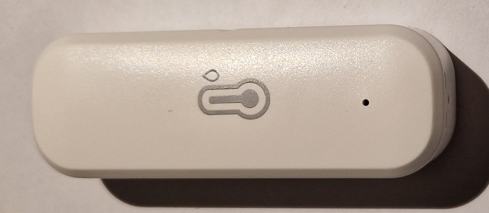
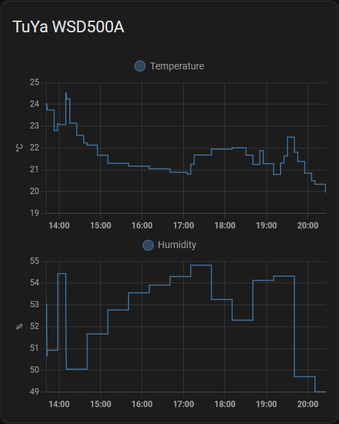
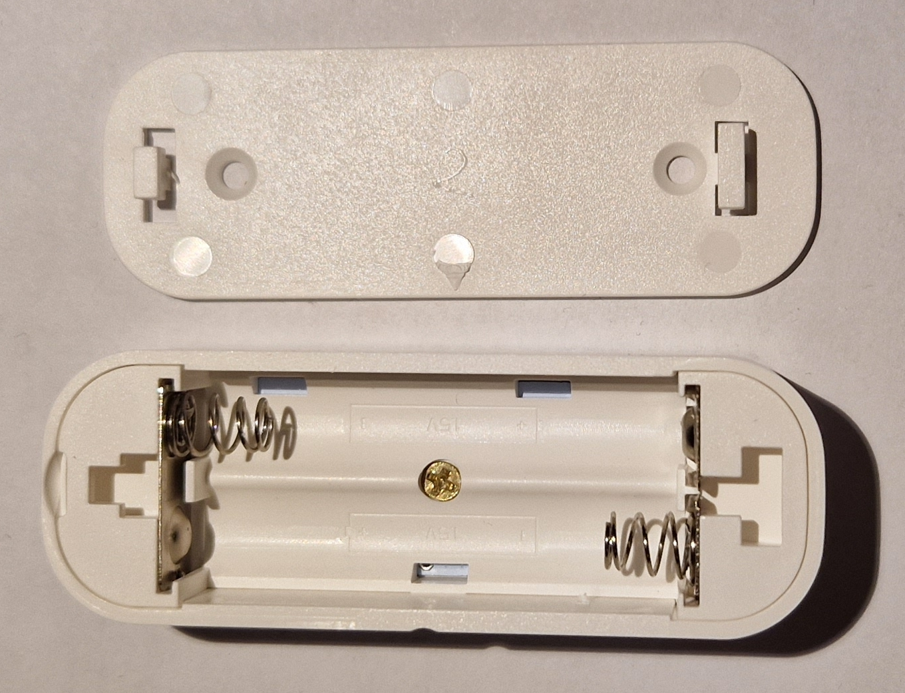
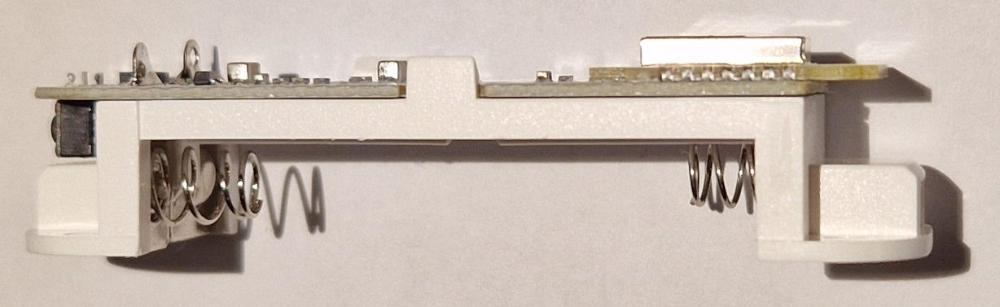
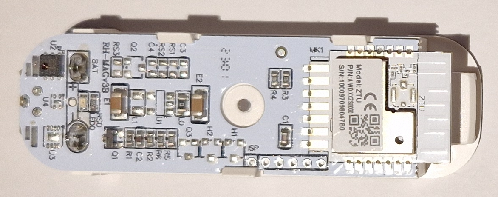

# TuYa WSD500A

Tuya **ZigBee Thermometer and Hygrometer**

*State (2023.05): Works good*


*TuYa WSD500A front with "LED hole"*

Features:
* Model: TuYa WSD500A
* Measured temperature range: -20~60 °C (accuracy: +-1 °C, resolution: 0.01 °C)
* Measured humidity range: 0~100 % (accuracy: +-5 %, resolution: 0.01 %)
* Battery: 2*AAA
* Protocol: ZigBee
* Dimensions: 70x24x19 mm

The model designation "WSD500A" origins from Zigbee2MQTT and is nowhere found on the aliexpress page, packaging, "manual" or the device itself. There are two or three different "TuYa temp & hum" ZigBee sensors (at least with different casings) available on Aliexpress, I don't know the differences ...

Aliexpress: 7 € (2023.05)

--------

## Usage

### ZigBee Join Mode

After adding the batteries for the first time, the device won't enter join mode automatically. Press a wire into the RESET hole for a few seconds until the LED flashes.

### Battery

Battery life: TODO

Battery replacement: To open the case, slide the back cover towards the arrow.

--------

## Zigbee2MQTT

https://www.zigbee2mqtt.io/devices/WSD500A.html#tuya-wsd500a

ZigBee2MQTT adds the device automatically during the join.

## Home Assistant

```
type: history-graph
entities:
  - entity: sensor.0xa4c1388a6b7914ec_temperature
    name: Temperature
  - entity: sensor.0xa4c1388a6b7914ec_humidity
    name: Humidity
title: TuYa WSD500A
```


*Home Assistant*

-------------------------

## Images


*Battery compartment*


*Side view (reset button on the left)*


*PCB*

TuYa ZTU module datasheet: https://solution.tuya.com/hardware/detail/61005
