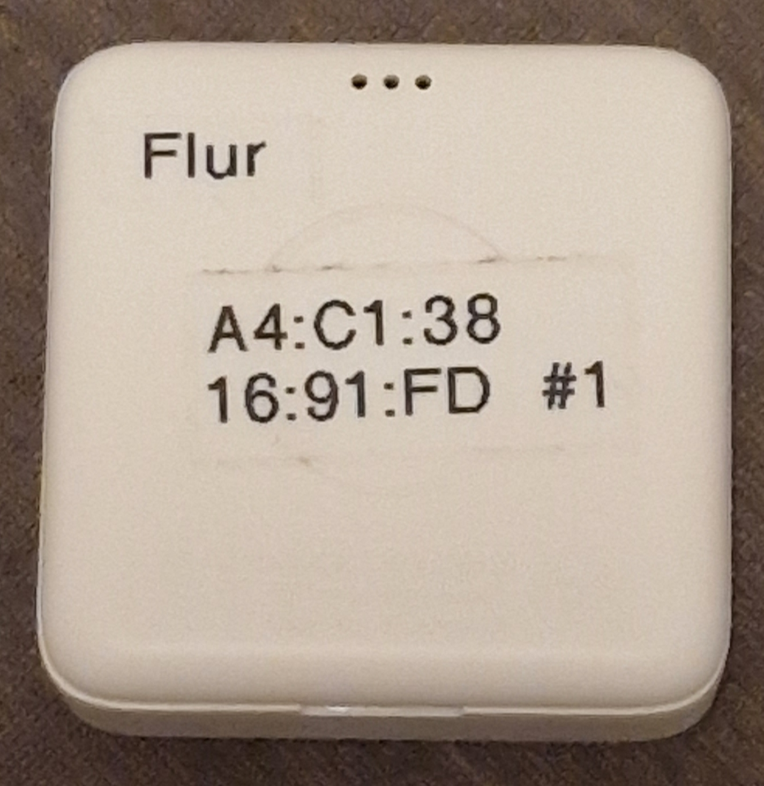
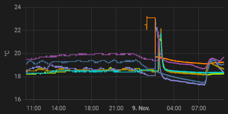

# Xiaomi Mijia LYWSD03MMC

Low cost **temperature and humidity sensor** with Bluetooth Low Energy (BLE) and LCD.

*State (2023.02): Flashing the custom ATC firmware and connect the device to Home Assistant using ESPHome (with an ESP32) was quite easy. I haven't tried to connect it over BLE to Home Assistant directly.*

*Update (2023.11): Batteries of the first devices failed in September. After replacing the CR2032 cell, the LCD remained blank and the battery failed again after 1-2 months. Changing from ATC to pvvx V4.4 firmware, the blank screen bug was gone. However, I need to keep an eye on the low battery life.*


*Xiaomi Mijia LYWSD03MMC*

Features:
* LCD
* Protocol: Bluetooth Low Energy (BLE)
* Temperature: 0~60 °C (±0.1°C) -> the -14 °C from my freezer is displayed
* Humidity: 0~99% RH (±1% RH)
* Battery: CR2032
* Dimensions: 43x43x12.5 mm

Aliexpress ~6€ (2023.02)

Some links with additional infos:

* https://www.youtube.com/watch?v=K-HG7qs9hK0
* https://blog.quindorian.org/2020/10/4-xiaomi-temperature-sensor-for-home-assistant.html/
* https://hackaday.com/2020/12/08/exploring-custom-firmware-on-xiaomi-thermometers/

--------

## Usage
### BLE Range

Using an ESP32 as a "BLE to WiFi bridge" is working ok for all the BLE devices in my flat. Between the ESP32 and any of the LYWSD03MMC there is a maximum distance of around 5m and two walls/doors

The connection to one LYWSD03MMC in the basement failed at the beginning (slightly higher distance plus the additional floor/ceiling). Moving the ESP32 in my flat closer to the center of all LYWSD03MMC (reducing the distance to the one in the basement to 1-2m plus floor/ceiling) is working fine now.

### Accuracy

The accuracy is listed in the user manual (±0.1°C and ±1% RH), but that's probably not the accuracy but simply the resolution.


*Fitfteen LYWSD03MMC after running a few hours at the same spot ...*

As I don't own a "known good thermometer", I've compared several of the devices to check at least the variance. The first row was bought 2022.02 and was already running for a few weeks. The remaining ten were bought 2023.02 and were fresh out of the box. All were using the custom ATC firmware. The temperature variance of 0.2 °C looks pretty good. The humidity variance of 3% is ok for me. Of course, an absolute error can't be detected this way and the long term stability is yet another question ...

For the price point, the results are really ok for me!

### Flash the Firmware

Flashing a custom firmware is straightforward, which makes life in ESPHome easy.

Not sure if the original firmware directly connects to ESPHome or Home Assistant (e.g. using a bluetooth USB dongle?). I haven't done any experiments in that direction and just flashed the custom firmware ...

#### ATC or pvvx firmware?

There seems to be two alternative custom firmware variants available:

* ATC: https://atcnetz.blogspot.com/
  * https://github.com/atc1441/ATC_MiThermometer
  * https://atc1441.github.io/TelinkFlasher.html
* pvvx  (with improvements over ATC):
  * https://github.com/pvvx/ATC_MiThermometer
  * https://pvvx.github.io/ATC_MiThermometer/TelinkMiFlasher.html

Update 2023.11: In the meantime, even the ATC page (https://github.com/atc1441/ATC_MiThermometer) suggests to use the improved pvvx firmware variant. If I would start from scratch, I'd use pvvx.

**I've only tried the ATC firmware, so the following describes that variant ...**

#### Flash using Android with Chrome

Flash is really simple when using an **Android Handy with a recent Chrome browser**.

Download the latest firmware "ATC_Thermometer.bin" to the Android handy, https://github.com/atc1441/ATC_MiThermometer/releases (click on "Assets" of the latest Release)

Point Chrome to: https://atc1441.github.io/TelinkFlasher.html

At that page:
* Connect -> select the device to flash from the pop-up (LYWSD03MMC)
* Do Activation (seems only necessary with the factory firmware)
* Durchsuchen ... to load firmware from the local filesystem
* Start Flashing

Look at the bottom of the page, the log may indicate any problems.

### Bluetooth Name and MAC address

Before flashing, the factory Bluetooth name of all devices will be LYWSD03MMC.

After flashing the ATC firmware, the name depends on the MAC address and will be something like: ATC_010203. The first part is fixed to "ATC_", the second part "010203" is the last three bytes of the Bluetooth MAC address. The first three bytes of the MAC address are fixed to A4:C1:38, so the full address in this example would be: A4:C1:38:01:02:03

You can use *sudo hcitool lescan* on Linux, to list all active BLE devices.

### Avoid Confusion
The list of Bluetooth devices can already be pretty crowded. Handling of another 10+ devices can easily get confusing. Setting up the devices "one by one" is a good idea:

* power up only one device
* look for Bluetooth device with the factory name LYWSD03MMC (there should be only one)
* flash firmware (Bluetooth name changes to ATC_...)
* note down the new Bluetooth name

I've used a label printer to write the MAC address and "my own serial number" at the back of each device. Later I've added a label of the location. That made the handling of 10+ devices in use A LOT easier.


*Labels on the back with location, MAC address and "my own serial number"*

### Optional: Adjust offsets of temperature and humidity in ATC firmware

The measured values are already pretty accurate without adjustments. If a "known good reference" is available, the offsets can be adjusted in the ATC firmware.

TODO: add description

https://github.com/atc1441/ATC_MiThermometer/issues/168

### Known bugs

#### Blank display after battery change

There is an ATC firmware bug (2023.02) that after changing the battery, the display is left blank. To fix this, flash the original Firmware and then the ATC Firmware back.
https://github.com/atc1441/ATC_MiThermometer/issues/256 (in the issues link you'll find a link to the original firmware)
Update 2023.11: My switch to the pvvx firmware fixed this bug (more details below)

#### Weird display on very low battery

When the battery is really low, the display shows strange things.

--------
## ESPHome

The following assumes to use an ESP32 running ESPHome as a bridge between Bluetooth Low Energy (BLE) and Wifi. Only the ESP32 supports BLE, so the ESP8266 won't work here.

### ESPHome: yaml file

https://esphome.io/components/sensor/xiaomi_ble.html

```
sensor:
  - platform: atc_mithermometer
    mac_address: "A4:C1:38:01:02:03"  // <- must be adjusted to the actual address
    temperature:
      name: "Flur Temperatur"
    humidity:
      name: "Flur Luftfeuchte"
    battery_level:
      name: "Flur Batterie-Level"
    battery_voltage:
      name: "Flur Batterie-Spannung"
    signal_strength:
      name: "Flur Signal"
```

Hint: Spend some thoughts to set the names "correct" at the first time, changing them later causes some effort in Home Assistant.

## Home Assistant

Make sure to have the ESPHome integration installed.

The values should appear in home assistant with an entity-id of e.g. *sensor.flur_temperatur* (derived from the name "Flur Temperatur" in ESPHome) without further intervention.

## 2023.11: Change from ATC to pvvx firmware

After the first devices failed due to low battery, I've changed the failed CR2032 cells. That caused a blank LCD screen (see known bugs section above) but values showed up again in Home Assistant. Only 1-2 months later, the battery failed again. I'm not sure if this is caused by a firmware bug (in combination with the blank LCD) or if the "new" cell was already just too old.

In an attempt to fix these issues, I've changed the firmware to the latest pvvx version - at least the blank LCD bug was fixed. After inserting the battery, the LCD shows the measured values as expected now. Time will tell if the battery problem will also be gone ...

### Firmware update from ATC to pvvx "ATC_v44.bin"
Selecting the right browser for the update can be a bit tricky. I've used Chrome on Android before, but that didn't worked any longer for me. The "new pvvx Flasher" page https://pvvx.github.io/ATC_MiThermometer/TelinkMiFlasher.html suggests that Chrome, Opera or Edge should work. I've switched to Chrome on Windows.

- open Chrome on Windows
- enable "experimental" setting in Chrome, open the following URL in Chrome: *chrome://flags/#enable-experimental-web-platform-features* and switch to enabled
- download pvvx firmware: https://github.com/pvvx/ATC_MiThermometer#firmware-binaries ("LYWSD03MMC Custom Firmware Version 4.4" when writing this)
- open the "old flash tool" page: https://atc1441.github.io/TelinkFlasher.html
(firmware update from "old" ATC to "new" pvvx was only possible with the "old flash tool". The "new pvvx Flasher" https://pvvx.github.io/ATC_MiThermometer/TelinkMiFlasher.html failed to connect to devices running the old ATC Firmware)

To flash the firmware on that flasher page:
- "Connect" button
- select the correct BLE device in the appearing dialog and click "Koppeln"
- wait that "Detected custom Firmware" appears in the log at the bottom of the page
- "Datei auswählen" button and open the downloaded *ATC_v44.bin* file
- "Start Flashing" button
- wait for status text below the button to show that flashing completed

Flashing is pretty quick (10 seconds or so). For whatever reason, one device (out of the 15 I have) took significantly longer (about 10 minutes!).

### Changes in ESPHome
Seems that pvvx uses a different data format compared to ATC. After the change update, no measuring values showed up in Home Assistant.

In ESPHome yaml file, change "platform: atc_mithermometer" to "platform: pvvx_mithermometer" (for details see: https://esphome.io/components/sensor/xiaomi_ble.html) and upload the new firmware to the ESP32

### Checking if values appear in the ESPHome Log or in Home Assistant
The corresponding values should appear in the ESPHome log again. While the former ATC firmware provided values with one digit after the colon "21.3", pvvx now provides two digits "21.31".

As a nice side effect, the history card in Home Assistant shows smoother curves now :-)


*Smoother history curves after the switch to pvvx firmware*
