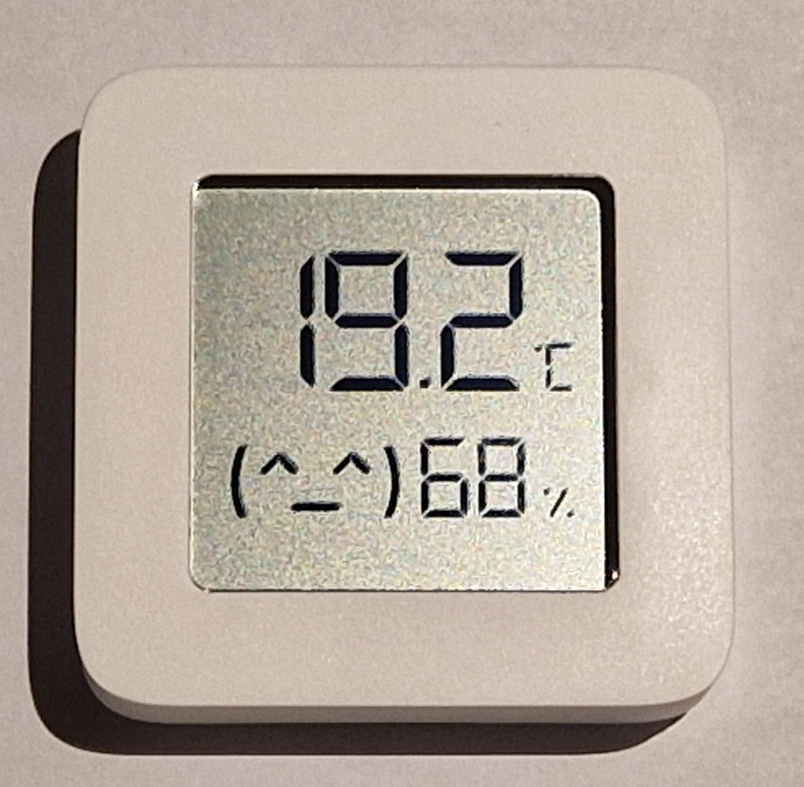
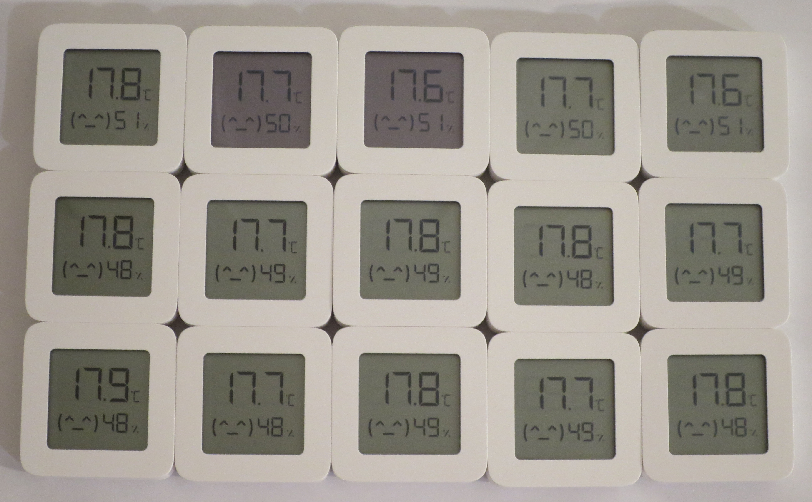

# Xiaomi Mijia LYWSD03MMC

Low cost **temperature and humidity sensor** with Bluetooth Low Energy (BLE) and LCD.

*State (2023.02): Flashing the custom ATC firmware and connect the device to Home Assistant using ESPHome (with an ESP32) was quite easy. I haven't tried to connect it over BLE to Home Assistant directly.*


*Xiaomi Mijia LYWSD03MMC*

Features:
* LCD
* Bluetooth Low Energy (BLE)
* Temperature: 0~60 °C (±0.1°C) -> the -14 °C from my freezer is displayed
* Humidity: 0~99% RH (±1% RH)
* Battery: CR2032
* 43x43x12.5 mm

Aliexpress ~6€ (2023.02)

Some links with additional infos:

https://www.youtube.com/watch?v=K-HG7qs9hK0
https://blog.quindorian.org/2020/10/4-xiaomi-temperature-sensor-for-home-assistant.html/
https://hackaday.com/2020/12/08/exploring-custom-firmware-on-xiaomi-thermometers/

## BLE Range

Using an ESP32 as a "BLE to WiFi bridge" is working ok for all the BLE devices in my flat. Between the ESP32 and any of the LYWSD03MMC there is a maximum distance of around 5m and two walls/doors 

However, the connection to one LYWSD03MMC in the basement failed (slightly higher distance plus the additional floor/ceiling). I had to place a second ESP32 in my flat closer to the LYWSD03MMC (reducing the distance to 1-2m plus floor/ceiling) which is working fine now.

## Accuracy

The accuracy is listed in the user manual (±0.1°C and ±1% RH), but that's probably not the accuracy but simply the resolution.


*Fitfteen LYWSD03MMC after running a few hours at the same spot ...*

As I don't own a "known good thermometer", I've compared several of the devices to check at least the variance. The first row was bought 2022.02 and was already running for a few weeks. The remaining ten were bought 2023.02 and were fresh out of the box. All were using the custom ATC firmware. The temperature variance of 0.2 °C looks pretty good. The humidity variance of 3% is ok for me. Of course, an absolute error can't be detected this way and the long term stability is yet another question ... 

For the price point, the results are really ok for me!

## Flash the Firmware

Flashing a custom firmware is straightforward, which makes life in ESPHome easy.

Not sure if the original firmware directly connects to ESPHome or Home Assistant (e.g. using a bluetooth USB dongle?). I haven't done any experiments in that direction and just flashed a custom firmware ...

### ATC or pvvx firmware?

There seems to be two alternative custom firmware variants available:

* ATC: https://atcnetz.blogspot.com/
  * https://github.com/atc1441/ATC_MiThermometer
  * https://atc1441.github.io/TelinkFlasher.html
* pvvx  (with improvements over ATC):
  * https://github.com/pvvx/ATC_MiThermometer
  * https://pvvx.github.io/ATC_MiThermometer/TelinkMiFlasher.html

Even the ATC page (https://github.com/atc1441/ATC_MiThermometer) suggests to use the improved pvvx firmware variant. If I would start from scratch, I'll use pvvx.

**I've only tried the ATC firmware, so the following describes that variant ...**

### Flash using Android with Chrome

Flash is really simple when using an **Android Handy with a recent Chrome browser**.

Download the latest firmware "ATC_Thermometer.bin" to the Android handy, https://github.com/atc1441/ATC_MiThermometer/releases (click on "Assets" of the latest Release)

Point Chrome to: https://atc1441.github.io/TelinkFlasher.html

At that page:
* Connect -> select the device to flash from the pop-up (LYWSD03MMC)
* Do Activation
* Durchsuchen ... to load firmware from the local filesystem
* Start Flashing

Look at the bottom of the page, the log may indicate any problems.

## Optional: Adjust offsets of temperature and humidity in ATC firmware

The measured values are already pretty accurate without adjustments. If a "known good reference" is available, the offsets can be adjusted in the ATC firmware.

TODO: add description

https://github.com/atc1441/ATC_MiThermometer/issues/168

### Known bugs

#### Blank display after battery change

There is an ATC firmware bug (2023.02) that after changing the battery, the display is left blank. To fix this, flash the original Firmware and then the ATC Firmware back.
https://github.com/atc1441/ATC_MiThermometer/issues/256 (in the issues link you'll find a link to the original firmware)

#### Weird display on very low battery

When the battery is really low, the display shows strange things.

## ESPHome

Only the ESP32 supports BLE, so the ESP8266 won't work here.

### Bluetooth Name and MAC address

Before flashing, the Bluetooth name of all devices will be LYWSD03MMC.
After flashing the ATC firmware, the name depends on the MAC address and will be something like: ATC_010203, the second part is the last three bytes of the Bluetooth MAC address. The first three bytes are fixed to A4:C1:38.

The MAC address in this example would be: A4:C1:38:01:02:03

You can use *sudo hcitool lescan* on Linux, to list all active BLE devices.

### ESPHome: yaml file

https://esphome.io/components/sensor/xiaomi_ble.html

```
sensor:
  - platform: atc_mithermometer
    mac_address: "A4:C1:38:01:02:03"  // <- must be adjusted to the actual address
    temperature:
      name: "Flur Temperatur"
    humidity:
      name: "Flur Luftfeuchte"
    battery_level:
      name: "Flur Batterie-Level"
    battery_voltage:
      name: "Flur Batterie-Spannung"
    signal_strength:
      name: "Flur Signal"
```

Hint: Spend some thoughts to set the names "correct" at the first time, changing them later causes some effort in Home Assistant. 

### Home Assistant

The values should appear in home assistant with an entity-id of e.g. *sensor.flur_temperatur* (derived from the name "Flur Temperatur") without further intervention. 

Obviously, you need to have the ESPHome integration installed.
