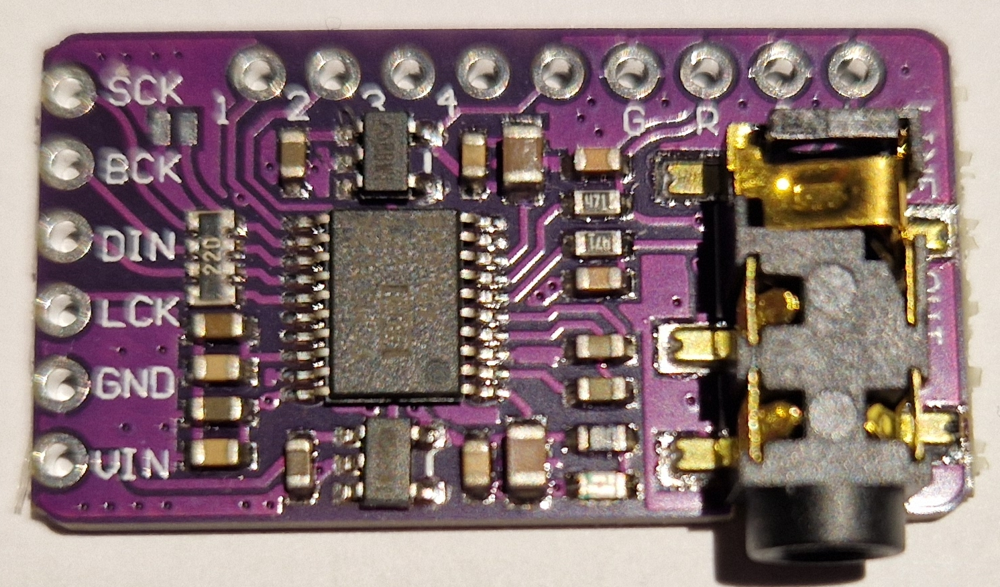
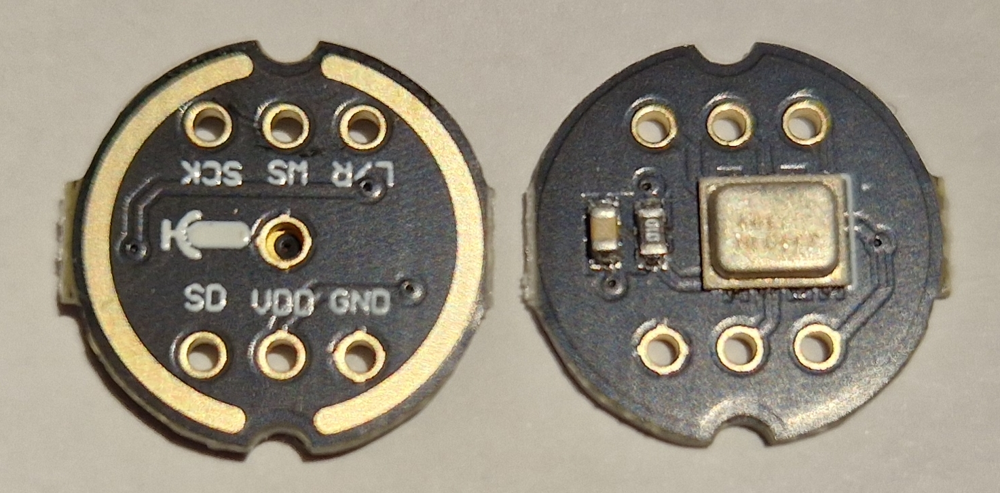

# I2S and ESP32

I2S "Inter-IC Sound" https://en.wikipedia.org/wiki/I%C2%B2S is a serial digital bus used to transfer digital PCM audio data from one chip to another. It can be used to connect an ESP32 microcontroller with audio chips. I2S is used for mono or stereo signals, I've not seen 5.1 surround sound or alike.

I2S is available on the ESP32 (incl. ESP32 WROOM, ESP32 WROVER, ESP32 S2, ESP32 S3 and ESP32 C3). The ESP8266 has no support for I2S, so **an ESP8266 won't work**.

## I2S Audio Output

The ESPHome "I2S Audio Media Player" https://esphome.io/components/media_player/i2s_audio.html can use different I2S chips (e.g. UDA1334A, PCM5102A or MAX98357).

These chips contain a mono or stereo DAC https://en.wikipedia.org/wiki/Digital-to-analog_converter and some other components in a single chip. Some contain a mono audio power amplifier.

The ESP32 also has an internal DAC (8 bit), but that seems to be a bit noisy: https://community.home-assistant.io/t/esphome-i2s-media-player-internal-dac/434280 so this is not an option for me.

## I2S Audio Input

The ESPHome "I2S Audio Microphone" https://esphome.io/components/microphone/i2s_audio.html can be used with "all in one" I2S microphone chips (e.g. INMP441).

I couldn't find an ADC "analog audio in" breakout board, that could be used to digitize analog sources like vinyl or tape recordings.

## I2S Chip Overview

Likely incomplete overview (2024.07) of easy to purchase "breakout boards" with I2S chips:

| Chip | Function | Price for PCB | Remarks | Link | Picture |
| --- | --- | --- | --- | --- | --- |
| PCM5102A | Stereo DAC | ~2 € | 112 bB SNR | [PCM5102A Media Player](PCM5102A_Media_Player.md) |  |
| PCM5122A | Stereo DAC | ~15 € | PCM5102A with I2C config? PCB designed as "Pi hat" | https://esphome.io/components/media_player/i2s_audio.html |
| UDA1334A | Stereo DAC | ~4 € | Chip seems discontinued | https://esphome.io/components/media_player/i2s_audio.html |
| MAX98357 | Mono DAC & 3W power amplifier | ~2 € | 3W (4 Ω), 1.4W (8 Ω) | [MAX98357 Media Player](MAX98357_Media_Player.md) |  |
| NS4168 | Mono DAC & 2.5W power amplifier | ~14 € | Only as M5Stack module, no standalone PCB | https://esphome.io/components/media_player/i2s_audio.html |
|INMP441 | Mono microphone | ~2 € | | https://esphome.io/components/microphone/i2s_audio.html |  |

## Bus Lines

The connection between the ESP32 and an I2S chip usually consists of three lines (+ power). Keep the lines as short as possible.

For audio output chips you'll use:

| Line (ESP32 side) | Function | ESPHome yaml |
| --- | --- | --- |
| BCLK / SCK | bit clock | i2s_bclk_pin |
| LRCLK / WS | left right clock / word select | i2s_lrclk_pin |
| DOUT / SD | serial data (output) | i2s_dout_pin |

You'll connect the DOUT (serial data out) to the DIN (serial data in) of the I2S chip.

For audio input chips you'll use:

| Line (ESP32 side) | Function | ESPHome yaml |
| --- | --- | --- |
| BCLK / SCK | bit clock | i2s_bclk_pin |
| LRCLK / WS | left right clock / word select | i2s_lrclk_pin |
| DIN / SD | serial data (input) | i2s_din_pin |

TODO: I haven't tried I2S for input or connecting both input and output chips to a single ESP32, however this should be possible.

TODO: Add physical infos: Max. frequency, voltages, ...

## I2S in ESPHome

Using I2S in ESPhome is pretty easy.

Beside the yaml specific part for the output "media_player" or input "microphone", you also need to configure the "i2s_audio" component https://esphome.io/components/i2s_audio which serves as a basis for both I2S output and input.

Example ESPHome yaml snippet for a stereo output using an external DAC:
```
...

i2s_audio:
  i2s_lrclk_pin: GPIO26
  i2s_bclk_pin: GPIO27

media_player:
  - platform: i2s_audio
    name: "Speaker"
    dac_type: external
    i2s_dout_pin: GPIO25
    mode: stereo
```
