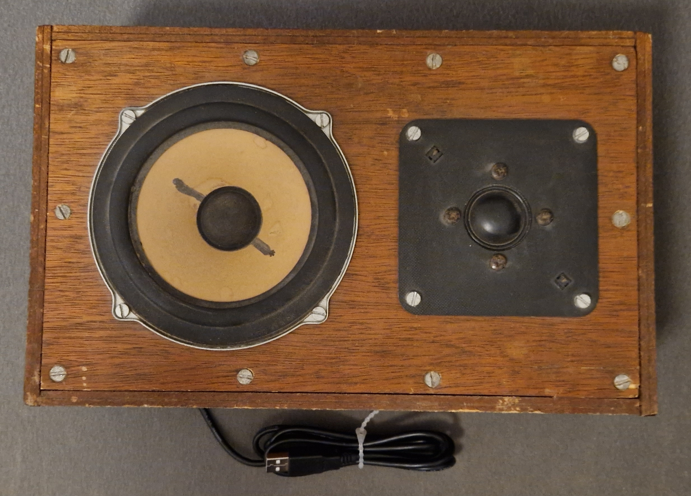
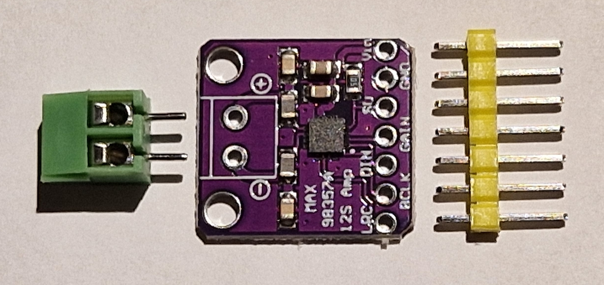
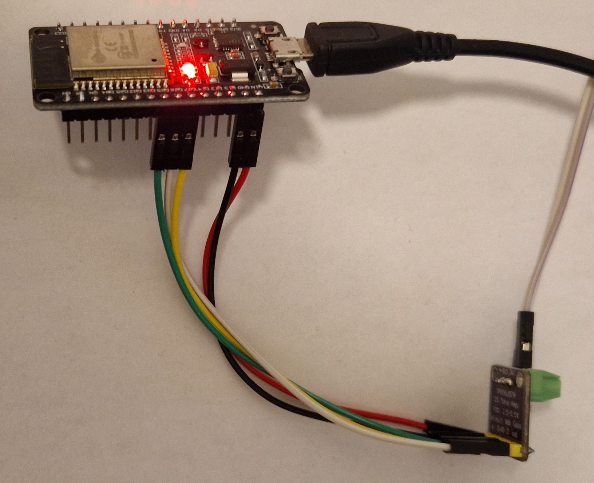
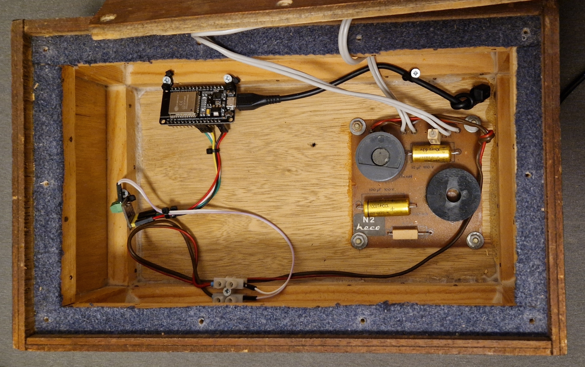

# MAX98357 Media Player

How to build a **WiFi connected mono loudspeaker (aka: media player)** with an ESP32, a MAX98357 and a speaker.

*State (2024.07): Speaker works and the sound quality is ok. Works fine for radio and text-to-speech, but probably not as a "party boombox".


*My 30+ year old Heco box -> my new Wifi connected and USB powered media player*

## ESPHome Media Player

With an ESP32 (ESP8266 will not work!), a cheap MAX98357 (mono I2S DAC & amplifier chip) and a common loudspeaker you can build a simple media player for Home assistant. Read: A WiFi connected loudspeaker.

Media player basics: https://esphome.io/components/media_player/index.html#

---------------------
## Hardware
### I2S

I2S "Inter-IC Sound" https://en.wikipedia.org/wiki/I%C2%B2S is used to connect the ESP32 microcontroller with audio chips. I2S is available on the ESP32 only, an ESP8266 won't work.

More I2S details at: [I2S and ESP32](I2S_and_ESP32.md)

The MAX98357 contains a mono DAC https://en.wikipedia.org/wiki/Digital-to-analog_converter, a class D amplifier https://en.wikipedia.org/wiki/Class-D_amplifier and some other components in a single chip.

### MAX98357 Board

MAX98357:

* Mono I2S DAC and class D amplifier
* Output Power: 3.2W (4 Ω, 5V)
* Output Power: 1.4W (8 Ω, 5V)
* Supply Voltage: 2.5V to 5.5V

Datasheet: https://www.analog.com/media/en/technical-documentation/data-sheets/MAX98357A-MAX98357B.pdf

Aliexpress: Board with "connectors" ~2€ (2024.07)


*MAX98357 board*

### Connections

Connect the MAX98357 board to an ESP32 board:

| MAX98357 | color | ESP32 |
| --- | --- | --- |
| 5V | red | 5V |
| GND | black | GND |
| SD | - | - |
| GAIN | - | - |
| DIN | green | 25 |
| BCLK | yellow | 27 |
| LRC | white | 26 |

Be careful to use the correct pin numbers on the ESP32. I'm using a nodemcu board, the pin numbering on other ESP32 boards may differ.


More infos about connecting the hardware: https://circuitdigest.com/microcontroller-projects/esp32-based-internet-radio-using-max98357a-i2s-amplifier-board

The board defaults to mono (sum of left and right). It can be set to "left only" or "right only" with the SD pin. The gain can be adjusted with the GAIN pin. However, I haven't done experiments with those pins. More information how to use these pins can be found in the datasheet.


*ESP32 and MAX98357 boards connected - USB 5V powered - grey and white wires towards the loudspeaker*

### Power Supply & Consumption

I supply the ESP32 with 5V from a small USB power adapter (phone charger) and connect the ESP32 5V pins with the MAX board (red and black wires).

As I'm using the box for "low volume" radio and alike, this works just fine. However, I haven't tested this as a "party boombox" ;-)

In idle, the ESP32 and MAX98357 together take: 5V * 0,05A = 0,25W

### The box
I had an old unused set of Heco boxes (4Ω) around that I've bought already used 30+ years ago. They served me well for car stereo in my very first car - a [Renault 12](https://en.wikipedia.org/wiki/Renault_12).

Integrating the electronics was quite easy, the parts are held in place with some wood screws and zip ties, the not shown damping mat avoids any rattling ...


*Inside the box "DIY style"*

------

## ESPHome

https://esphome.io/components/media_player/i2s_audio.html
https://esphome.io/components/i2s_audio.html

You need at least ESPHome version 2023.4.1!

```
i2s_audio:
  i2s_lrclk_pin: GPIO26
  i2s_bclk_pin: GPIO27

media_player:
  - platform: i2s_audio
    name: ESPHome I2S Media Player
    dac_type: external
    i2s_dout_pin: GPIO25
    mode: mono
```

There was a breaking change in ESPHome 2023.4.0 (https://esphome.io/changelog/2023.4.0.html) and in that version the "I2S Media Player" was broken.

## Home Assistant

Once the ESP32 is set up and powered on, the "ESPHome I2S Media Player" simply appears in Home Assistant.

Obviously, you need to have the ESPHome integration installed.
