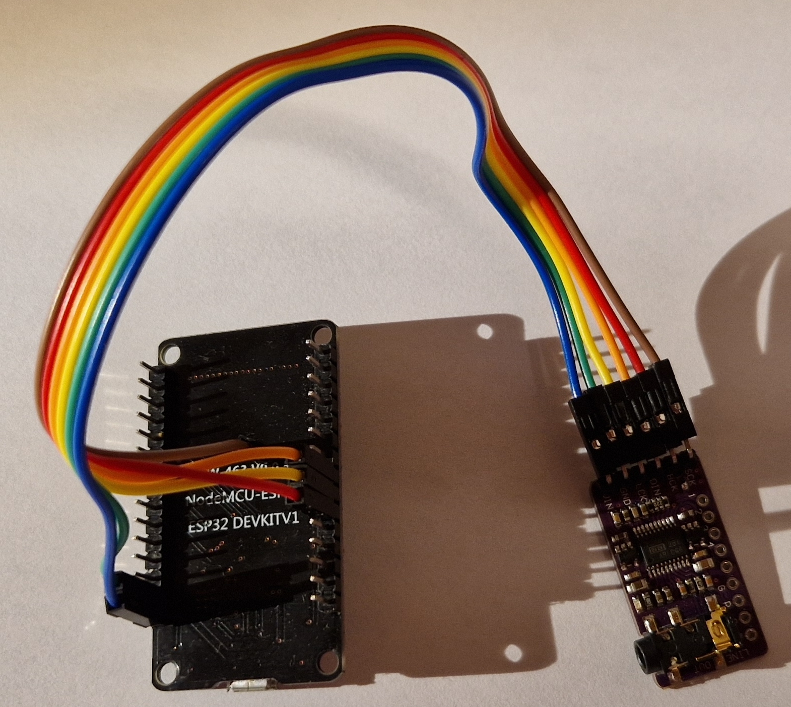
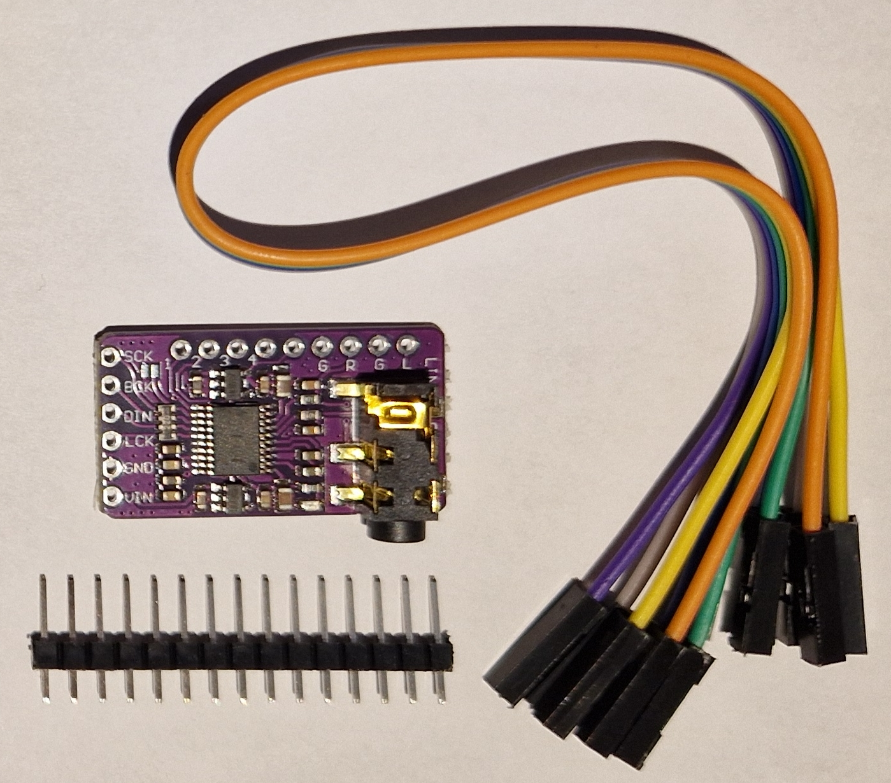
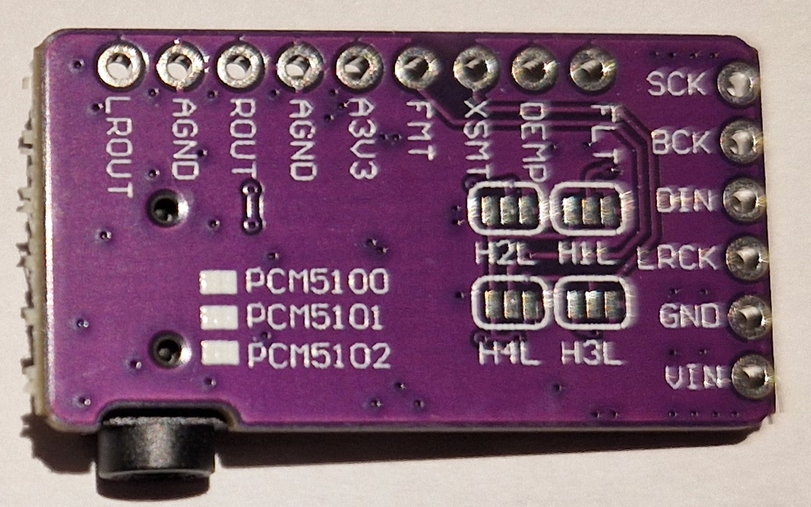
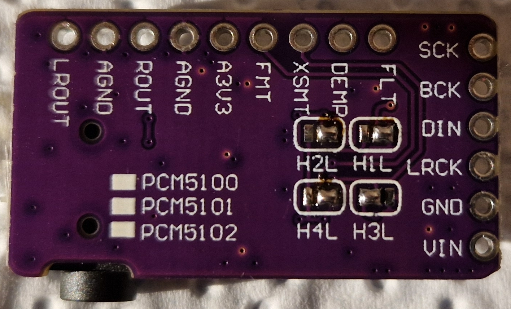
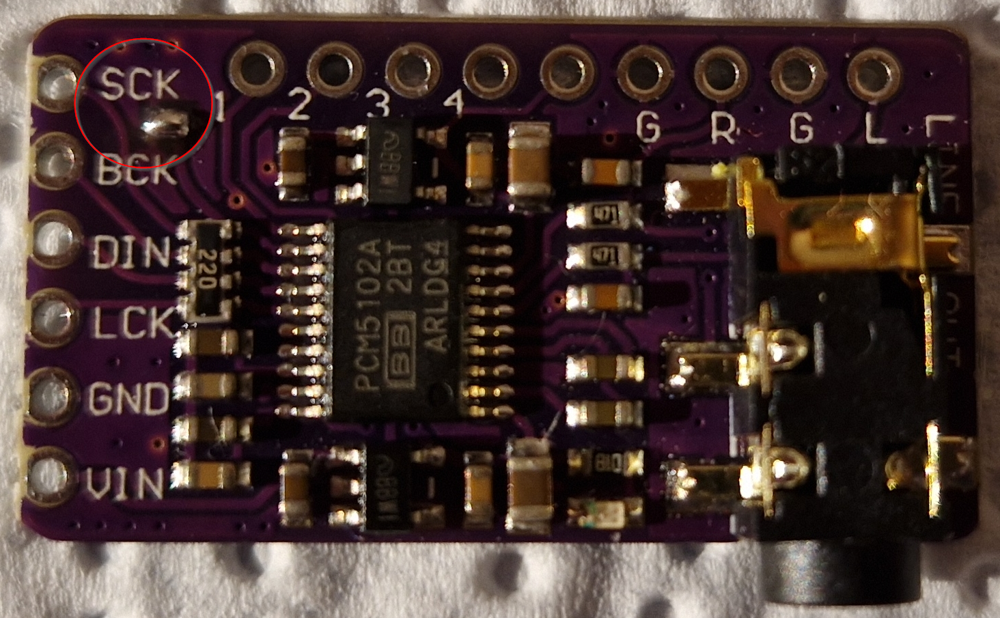
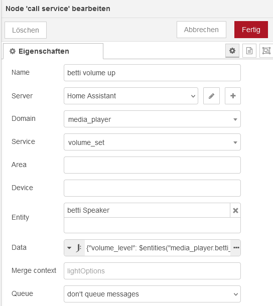
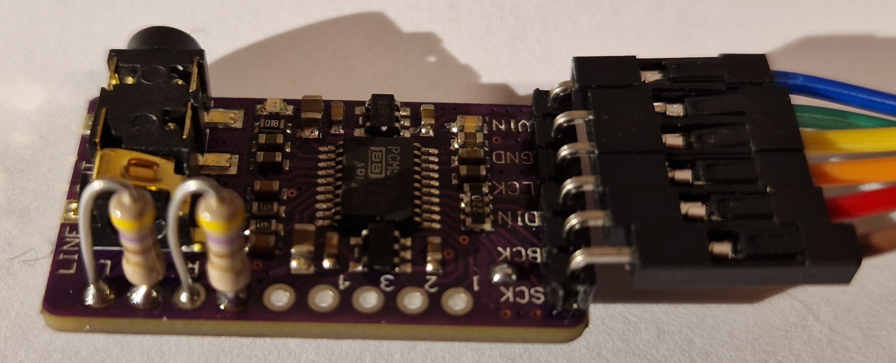

# PCM5102A Media Player

How to build a **WiFi connected audio bridge (aka: media player)** for your audio amplifier with an ESP32 and a PCM5102A.

*State (2024.07): Audio bridge works good, some quirks still exists*


*Media Player with ESP32 (left) and PCM5102A (right)*

## ESPHome Media Player

With an ESP32 (ESP8266 will not work!) and a cheap PCM5102A (stereo I2S DAC chip) you can build a simple media player for Home assistant.
Read: An audio bridge to connect Home Assistant over WiFi to an audio amplifier.

If you need a mono I2S DAC & 3W amplifier, have a look at: [MAX98357_Media_Player.md](MAX98357_Media_Player.md)

Media player basics: https://esphome.io/components/media_player/index.html#

---------------------
## Hardware
### I2S

I2S "Inter-IC Sound" https://en.wikipedia.org/wiki/I%C2%B2S is used to connect the ESP32 microcontroller with audio chips. I2S is available on the ESP32 only, an ESP8266 won't work.

More I2S details at: [I2S and ESP32](I2S_and_ESP32.md)

The PCM5102A contains a stereo DAC https://en.wikipedia.org/wiki/Digital-to-analog_converter and some other components in a single chip. It doesn't contain a power amplifier.

### PCM5102A Board

Features:

* Stereo I2S DAC (no power amplifier)
* Supply Voltage: 3.3V or 5V (board has a low drop voltage regulator and can be supplied with both 3.3 or 5V)
* SNR: 112 dB
* Sampling frequency: 8 kHz to 384 kHz
* Output to 3.5 mm stereo "headphone" jack or solder pins


*PCM5102A board with "accessories"*

Datasheet: https://www.ti.com/lit/gpn/pcm5102a

Aliexpress: ~2 € (2024.07)

Additional info links:
* https://todbot.com/blog/2023/05/16/cheap-stereo-line-out-i2s-dac-for-circuitpython-arduino-synths/ PCM5102A PCB pinout and more
* https://macsbug.wordpress.com/2021/02/19/web-radio-of-m5stack-pcm5102a-i2s-dac/ many (circuit) details
* https://raspberrypi.stackexchange.com/questions/76188/how-to-make-pcm5102-dac-work-on-raspberry-pi-zerow bridging pads and other good explanations by riban

### Solder pads for Configuration

There are five pins to configure the PCM5102A operating mode. There are solder pads on the PCB to configure this, four on the bottom side and one on the top side.

Some boards seem to come with presoldered pads. My pads were "unpopulated", so I had to solder the pads myself.


*PCM5102A board bottom side with four "unpopulated" solder pads "H1L" to "H4L"*

Connect the solder pads:

| Pin | Description | PCB Pad | Set to ... | High | Low |
| --- | --- | --- | --- | --- | --- |
| FLT  | Filter select | H1L (bottom) | L (GND) | Low latency (slightly poorer response) | **Normal latency** |
| DEMP | De-emphasis for 44.1 kHz | H2L (bottom) | L (GND) | on | **off (De-emphasis not needed)** |
| XSMT | Soft mute control | H3L (bottom) | H (3V3) | **Output not muted** | Output muted |
| FMT | Audio format | H4L (bottom) | L (GND) | Left-justified | **I2S format** |
| SCK | System clock input | SCK (top) | GND  | - | **Use internally generated system clock (PLL)** |

Connecting the middle pad to H connects it to digital 3.3 V, connecting it to L will set it to ground. After soldering the pads, make sure that you didn't accidentially shortened H with L.

XSMT can be connected to a GPIO pin to control output mute. I couldn't notice any difference between setting this pin to low or to set the volume to zero. If you experiment with this pin, don't forget to remove the connection on solder pads H3L.


*Soldered pads on the bottom side*


*SCK pad connected to GND on top side*

### Connections

Now its time to connect the PCM5102A with the ESP32. All necessary connection pins are on the shorter pin row.

| PCM5102A | ESP32 | ESPHome yaml | Description | Remark |
| --- | --- | --- | --- | --- |
| SCK | (not connected) | - | system clock input | solder pad "SCK to GND" on PCM PCB is used |
| BCK | GPIO27 | i2s_bclk_pin | I2S BCLK (bit clock) |
| DIN | GPIO25 | i2s_dout_pin | I2S DOUT (data) |
| LRCK / LCK | GPIO26 | i2s_lrclk_pin | I2S LRCLK (left right clock / word select) |
| GND | GND | - | ground |
| VIN | VIN | - | power supply | 3.3V or 5V will work, I'm using 5V here |

The connection pins on the longer pin row are usually not needed.

| PCM5102A | Description | Remark |
| --- | --- | --- |
| FLT | Filter select input | Same as middle pad of H1L |
| DEMP | De-emphasis for 44.1 kHz input | Same as middle pad of H2L |
| XSMT | Soft mute control input | Same as middle pad of H3L |
| FMT | Audio format input | Same as middle pad of H4L |
| A3V3 | Analog 3.3V output | Output of the analog side 3.3V voltage regulator |
| AGND | Analog ground | Same as on 3.5 mm stereo jack |
| ROUT | Right analog output | Same as on 3.5 mm stereo jack |
| AGND | Analog ground | Same as on 3.5 mm stereo jack |
| LOUT | Left analog output | Same as on 3.5 mm stereo jack |

An audio cable connects the 3.5 mm stereo jack output with the cinch/RCA inputs of my power amplifier for left and right.

### Power Supply & Consumption

I supply the ESP32 with 5V from a small USB power adapter (phone charger) and connect the ESP32 5V to the PCM board.

You can supply the PCM5102A board with 3.3 or 5V. The PCB has two 3.3V low drop voltage regulators (one for the analog and one for the digital circuit).

At idle, the ESP32 and PCM5102A together take: 5V * 0.13A = 0.65W

--------

## ESPHome

The initial ESP32 board setup in ESPHome is described at: [ESP Init for ESPHome](../esphome/ESP_init.md)

ESPHome infos about the I2S yaml config:

* https://esphome.io/components/media_player/i2s_audio.html
* https://esphome.io/components/i2s_audio.html
* Hint: You need at least ESPHome version 2023.4.1!

Yaml code snippet specific for the above I2S DAC setup:

```
i2s_audio:
  i2s_lrclk_pin: GPIO26
  i2s_bclk_pin: GPIO27

media_player:
  - platform: i2s_audio
    name: "Speaker"
    dac_type: external
    i2s_dout_pin: GPIO25
    mode: stereo
```

By default the output volume after power on is 100%, which is much too high for my setup. The following yaml snippet sets the default volume on boot to 15%.

```
esphome:
  name: PCM5102A
  on_boot:
    - media_player.volume_set: 15%
```

## Home Assistant

As usual, Home Assistant should automatically detect the new ESPHome device, just integrate it. No further configuration is required.

## Music Assistant

To integrate the media player into Music Assistant, have look at: [home_assistant_media_player.md](home_assistant_media_player.md)

Beware: If you uncheck "Enable queue flow mode" in the player, play will stop after the first track of an album was played

Current issues (2024.07):
* After playing a file (or album), the player pauses for a minute and then starts playing the same again and again until its manually stopped. Don't know if this is caused by the media player, Home Assistant or Music Assistant. TODO: Needs further investigation
* Both ESPHome and Home Assistant will notice a dis- or reappearing media player in a resonable amount of time. Music Assistant often does not notice this "state change" at all or it takes VERY long. Workaround is to remove the player completely from the "Home Assistant MediaPlayers" and add it again. TODO: Needs further investigation

## Node-RED

If calling the media_player volume_up service, the volume is raised by 10%, which is too coarse for my setup. The following raises the volume by only 5%:



The full Data string is:
```
{"volume_level": $entities("media_player.betti_speaker").attributes.volume_level + 0.05 }
```

Obviously you can add a corresponding "volume down" node by using "- 0.05".

I'm primarily using Node-RED for Automation, but similiar can be done with Home Assistant automations.

-------------------------

## Troubleshooting: Pop noises

When playing tracks:
* two very low volume short pop noises when play starts
* one low volume short pop/crack noise when play stops

While both are slightly annoying, they are not so loud that it's really an issue. However, I had a look if its possible to avoid this.

Seems to be caused by the PCM5102A
https://e2e.ti.com/support/audio-group/audio/f/audio-forum/765759/pcm5102-pop-noise-when-pause-and-play-music-in-android-music-player

The pops seem to happen when the PCM5102A goes into or gets out of sleep mode (can't find the source again).

This may also be caused by a counterfeit chip / board that I got from aliexpress.

When I set up another ESP32 & PCM5102A media player, I noticed that the two pop noises at play start are still there but the "more annoying" pop/crack noise at stop simply doesn't happen :-)

I've also checked the output mute pin XSMT. Even if it's set to mute, the two pop noises at play start still happen. It seems there is not a lot more that can be done about it.

-------------------------

## Troubleshooting: 50 Hz Hum

When I connected everything together and powered it all up, I got a very noticeable permanent 50 Hz humming noise :-(

Setup:
* ESP32 powered by USB mains power supply
* ESP32 connected with PCM5102A (power and data)
* Audio cable between PCM5102A and "Fosi Audio BT30D Pro" audio amplifier

#### Detect the humming cause
I was expecting a ground loop (german: Masseschleife) causing this hum. So I replaced the USB mains power supply with a USB power bank to avoid such a ground loop -> still 50 Hz humming

-> so not a 230 V mains "ground loop" problem as I first expected

Next steps:
* Audio cable unplugged from the PCM5102A PCB -> 50 Hz humming
* Touching the audio cable isolation -> louder 50 Hz humming
* Unplugged the audio cable from the amplifier (open cinch/RCA input) -> NO humming

-> So the humming is happening as soon as the audio cable is plugged into the amplifier. Plugging the other cable end to the PCM5102A board (or not) makes no difference.

Measured the resistance of the audio input and output sockets
* Resistance of amplifier input to GND is 10 kOhm each channel
* Resistance of PCM5102A PCB to GND is 10 MOhm each channel

-> so the output resistance of the PCM5102A is much higher than the input resistance of the amplifier
-> plugging the PCM5102A (with its 10 M Ohm) to the cable (or not) makes no difference
-> even with the PCM5102A connected, the amplifier practically has an open input and the cable catches 50 Hz hum

#### My Solution
Soldered a 470 Ohm resistor between each signal output and GND of the PCM5102A to lower the output impedance
-> silence :-)
-> if I place my ear directly to the speaker I still hear a very low humming, but that is ok for me
-> don't know it that is the "correct" solution, but it "works for me"


*Two 470 Ohm resistors soldered between the output pins and gound to lower the output impedance*

I've also tried to lower the resistor value down to 100 Ohm, but then the maximum achievable volume level is decreased significantly. It seems the PCM5102A cannot drive such a low resistance. The PCM5102 datasheet from TI lists: "Analog output / Load impedance: MIN 1 kOhm" so even my 470 Ohm resistor is already "a bit low". If I'm using a higher resistor (1 kOhm), the humming appears again. For comparison: My old CD player has a measured output resistance of 100 Ohm, my tuner has 4k5 Ohm.

I'm aware that measuring only the "DC resistance" with a multimeter is maybe not the "proper" way to do this, but it works for me. Hint to self: I've read somewhere, that the right way to measure the output impedance is to vary the load resistor until the output level is half of the unloaded level (so output and load impedance are equal).

To check if the PCB is doing something bad in the output circuit, I've compared the PCB circuit with the datasheet "Typical Application Circuits". For the output pins a 470 Ohm resistor in series and then a 2n2F capacitor to GND is used. The PCB is implementing the output circuit according to the datasheet, so nothing "wrong" here.
* PCB circuit: https://todbot.com/blog/2023/05/16/cheap-stereo-line-out-i2s-dac-for-circuitpython-arduino-synths/
* Datasheet: https://www.ti.com/lit/gpn/pcm5102a

##### 50 Hz Hum Conclusion

Seems the hum was caused by my "sensitive" audio amplifier and a very high output impedance of the PCM5102A. This problem may very well be specific to my setup/amplifier, so I wouldn't recommend to "blindly" solder resistors to the board if there is no issue.

-------------------------

## Conclusion

I wanted to play music using Music Assistant with a decent quality. So the idea was to have an "audio WiFi bridge" to my existing audio amplifier/speaker setup.

My first attempt with squeezelite on ESP32 failed as it has two many poorly documented parameters/options. A quick try with my [MAX98357 Media Player](MAX98357_Media_Player.md) showed that the ESP32 & I2S DAC combo in Home Assistant works. As the PCM5102A is only a few € I tried and it works good for me, **the sound quality is really good**.

However some quirks remain. The usability issues mentioned in the [Music Assistant](#music-assistant) section are probably software problems that can be resolved - needs further investigation. The two very low volume pop noises mentioned in [Troubleshooting: Pop noises](#troubleshooting-pop-noises) when the playing starts are likely PCM5102A specific and seems to be unavoidable with it.

It's mentioned that the output jack can drive most headphones: https://todbot.com/blog/2023/05/16/cheap-stereo-line-out-i2s-dac-for-circuitpython-arduino-synths/ I've tried it with a Koss Porta Pro, sound quality is ok but could be better.

All in all I'm quite happy with the PCM5102A but its not perfect!