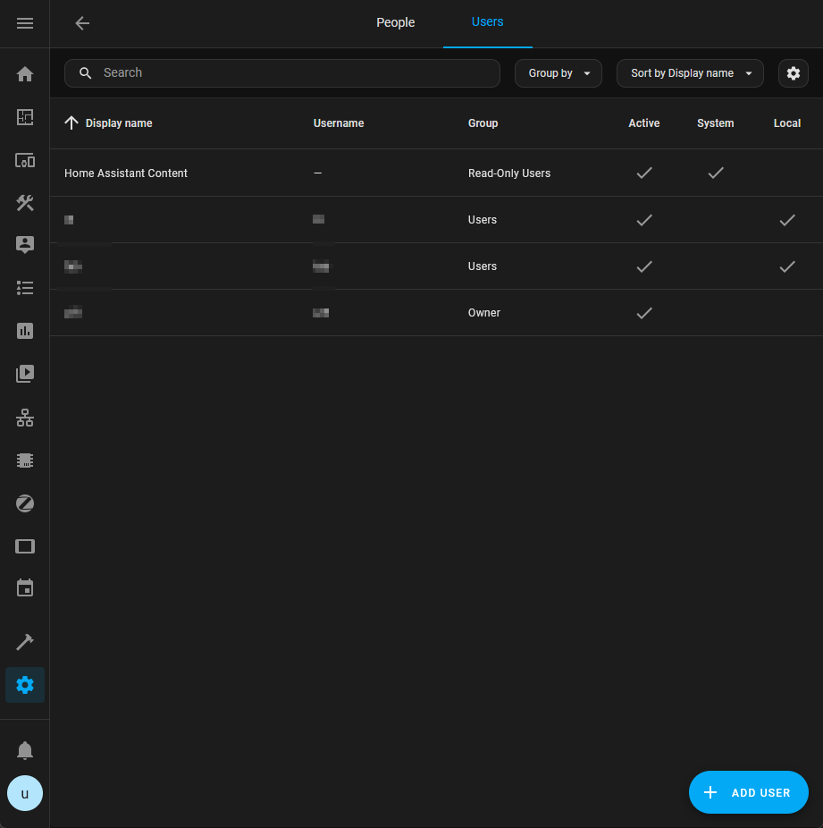

# Connect a Home Assistant Media Player to Music Assistant

The following describes how to prepare Music Assistant so it uses Home Assistant media players (aka: speakers). It uses a speaker build with ESPHome as an example, but the steps for other speakers in Home Assistant should be similiar or identical.

State (2024.07): My Home Assistant speakers work fine in Music Assistant!

My prerequisites:

- Music Assistant running ok in a docker container, not yet connected to Home Assistant
- Home Assistant running ok in a docker container
- Media player build with ESPHome running ok in Home Assistant

Beware: I'm not sure if the following steps are slightly different if you use the Home Assistant Add-on instead of the plain docker containers.

If you want to build an ESPHome based media player (aka: speaker) with ESP32 & MAX98357 on your own and add it to ESPHome/Home Assistant, please have a look at: [MAX98357_Media_Player.md](MAX98357_Media_Player.md). If you know how to solder its cheap and easy.

## Further Infos

A brief installation instruction for Home Assistant together with Music Assistant can be found here: https://music-assistant.io/integration/installation/

Known issues and notes about the "Home Assistant Player Provider" in Music Assistant can be found at: https://music-assistant.io/player-support/ha/ (especially have a look at the "Be aware" box about limited support!)

General support for Music Assistant: https://music-assistant.io/support/

## Check if speaker appears in Home Assistant
To avoid trouble later on, check that the speaker correctly appears in Home Assistant.

How to do this step depends on the type of media player to be used, in this example a speaker build with ESPHome & ESP32 is used.

In Home Assistant go to Settings > Devices & Services > ESPHome > #your speaker# > device

The page should at least show the Controls card as in the picture above. I've simply named my ESP32 device "heco" and the speaker entry "Speaker" but the actual names shouldn't be important.

TODO: Is there a simple generic way in HASS to list all available media players?

TODO: Add some simple steps to actually test the audio output of the speaker here?

## Add user "mass" to Home Assistant

This step is optional, but I tend to use different users for different external tools and such in Home Assistant.

In Home Assistant go to Settings > People > Users tab and press +ADD USER

You can choose the Display name, Username and Password as you like.

Add a user mass (or whatever name you prefer), a password and leave the other settings as is, then press CREATE

The new user should appear in the list now.

It's a good idea to note down these credentials in a password manager (I'm using KeepassXC).

## Connect MASS to HASS
Next step is to connect Music Assistant to Home Assistant.

In Music Assistant go to Home > Settings (cog icon top right), press ADD PLUGIN PROVIDER and select Home Assistant

In the appearing *Settings* page you need to enter the URL of the Home Assistant welcome page.

**Beware that the URL of your Home Assistant will very likely be different than the example below. So the URL will NOT be http://192.168.1.11:8123 for you!**

Note down the URL of your Home Assistant and remove the part with the slashes (for example my Home Assistant dashboard is at: http://192.168.1.11:8123/dashboard-test/home and the URL I need is: http://192.168.1.11:8123). It should also work to you use hostnames instead of IP addresses.

In the *Generic settings* enter the URL of your Home Assistant and press (RE)AUTHENTICATE HOME ASSISTANT:

A new browser tab will be opened automatically and if HASS can be found at the entered URL, it shows the Home Assistant welcome page. If something else appears or you get an error, check the URL and connection.

You can enter the user and password from above and press LOG IN:

You'll get back to the Music Assistant provider settings page. For a few seconds that page is "dimmed" and a "turning circle" appears while the connection is being established. Once that's done, just press SAVE and you've connected MASS to HASS :-)

If the connection fails, recheck your settings (user/pass, URL, ...) and the connection (firewall, VLAN, ...).

I had some issues creating the connection:
* I've entered the credentials in HASS, but still got no connection. I'm not 100% sure that this was the cause, but at least when I disabled my ufw firewall (sudo ufw disable) on the Ubuntu host machine, the connection worked fine.
* When I tried to reauthenticate later, I randomly got a "file not found" error from Home Assistant. When I've simply retried with the same credentials soon again it just worked.

## Add Speaker to Music Assistant

Last step is to add the "Home Assistant MediaPlayers provider" and the actual speaker (aka: media player) to Music Assistant.

In Music Assistant go to Home > Settings (cog icon top right), press ADD PLAYER PROVIDER and select *Home Assistant MediaPlayers*

In the appearing *Settings* page, select the *Player entities* to be used. MASS will automatically detect and list the available players and you can select more than one player if available:

Just press SAVE.

Beware: If you change the name of the player in ESPHome or Home Assistant later on, remember that you also need to reselect the *Player entities*.

If you press on the speaker icon (bottom right in the "play bar"), the speaker(s) should now appear in the list of Players:

In the Players settings (Home > Settings (cog icon top right) > Players (speaker icon top right)) you can change various player settings, but that's a different story ...

**Have fun with your "new speakers"!**
