# ESP Init for ESPHome

How to initialize an ESP32 or ESP8266 board with USB for first use with ESPHome.

You wil need:

* an ESP board to be initialized
* Windows, Linux or MacOS computer (the text below was only tested with Windows)
* a free USB port on the computer
* a suitable USB cable
* Chrome or Edge web browser (**Firefox will NOT work**)

There are many different ESP boards available. The following was tested with common ESP32 and ESP8266 boards like the D1-Mini.

Newer boards like the ESP32 S2 or ESP32 C3 may behave slightly different.

## USB connection

The first step is to connect the ESP board to the computer with a USB cable.

You don't need a special USB cable for this, it just needs to fit the connectors on both sides. However, be careful to choose a cable that provides both power and data - a simple "power only" cable won't work.

It's a good idea to temporarily disconnect other USB devices that uses a serial connection (microcontroller, GPS devices, ...) from the computer. This eases the selection of the right serial port later.

## Web Installer
Open web.esphome.io in Chrome or Edge and click CONNECT.

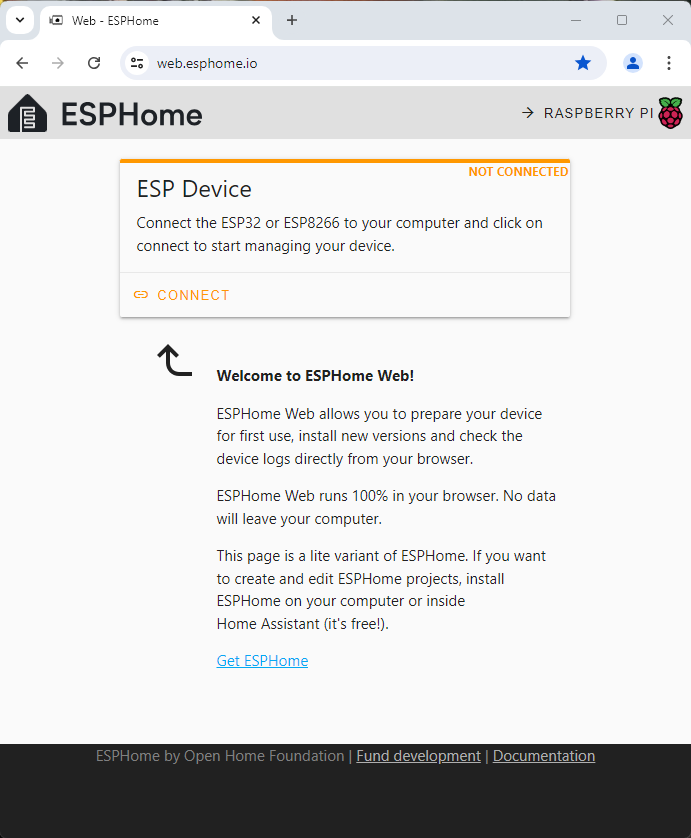

The installer then shows the available serial (COM) ports. If the installer can't find a serial port, you will see a message "No compatible devices found.". Select the serial port to use and press Connect:

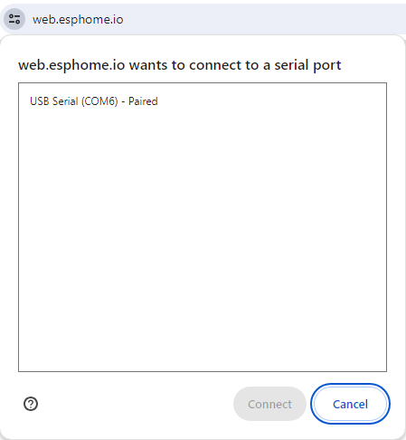

If you press Cancel, you will see a dialog with some hints for troubleshooting.

I had one board that required to press a boot button before Connect, so this might also be a reason for not showing up in the serial port list.

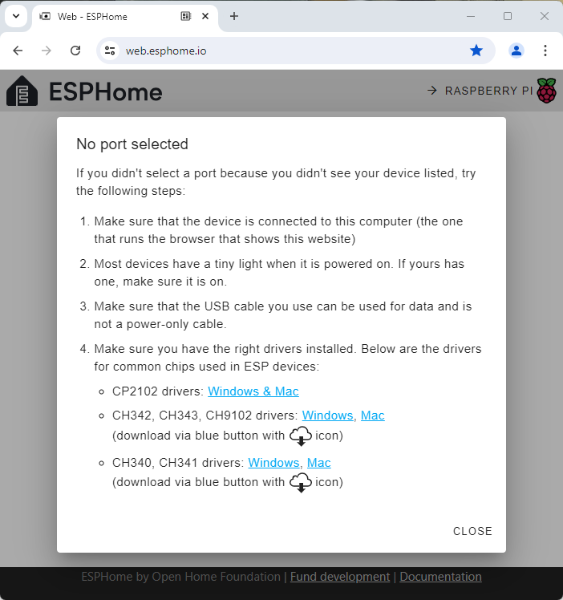

Once the connection was established, press PREPARE FOR FIRST USE

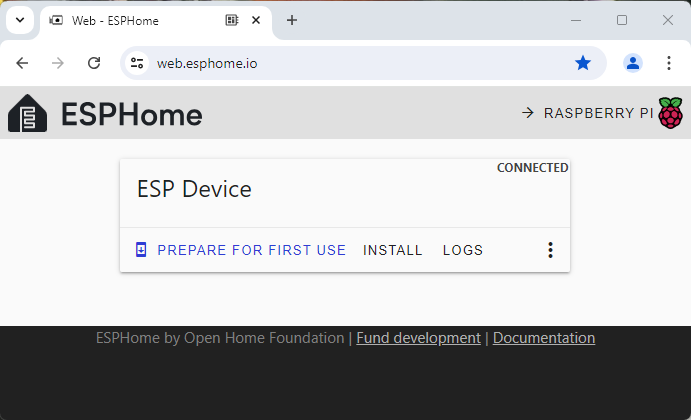

... and press INSTALL

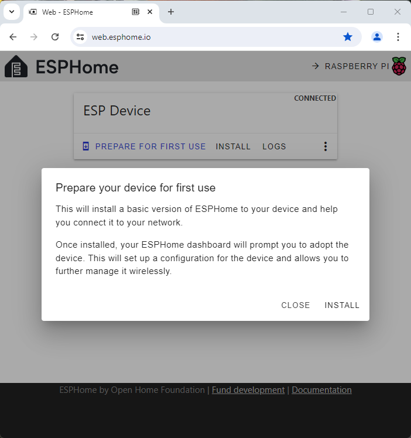

"Connecting" will be shown shortly, then installation starts (takes about a minute)

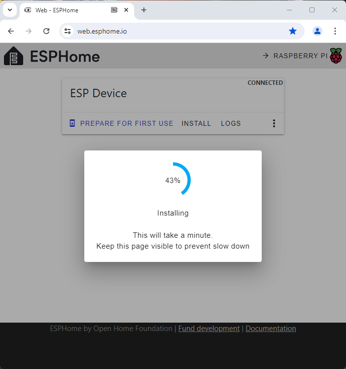

If everything works well, the install will finish successfully, press CLOSE

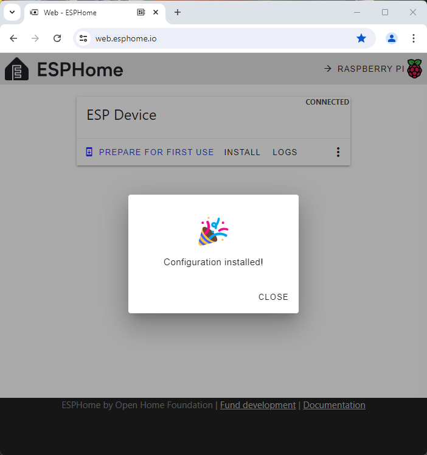

Now a dialog appears with the ESPs current name, in this case "esphome-web-1ed63b" (the 1ed63b are the last three bytes of the hardware MAC address), press CONNECT TO WI-FI

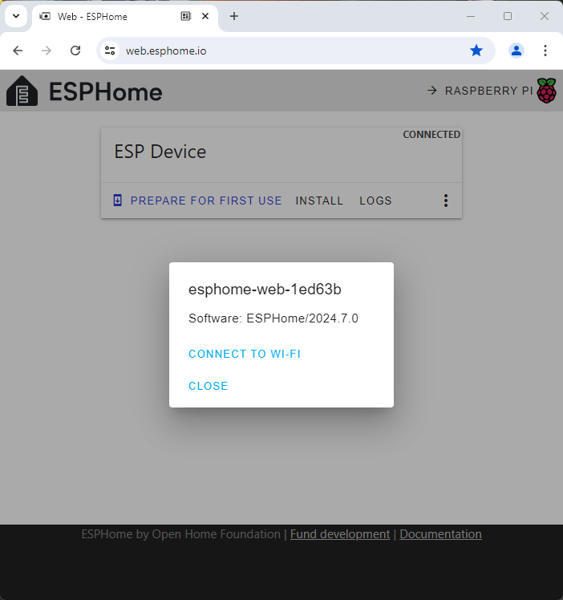

Select your WiFi network and enter the password for it.

As far as I know, the ESP boards supports only 2.4 GHz networks, 5 GHz networks are not supported.

If your desired network is not listed or the list stays empty, just CANCEL the dialog and retry to connect. Sometimes your network will now appear. Unfortunately some (cheap and broken) boards will simply not connect at all or show only a very small selection of networks.

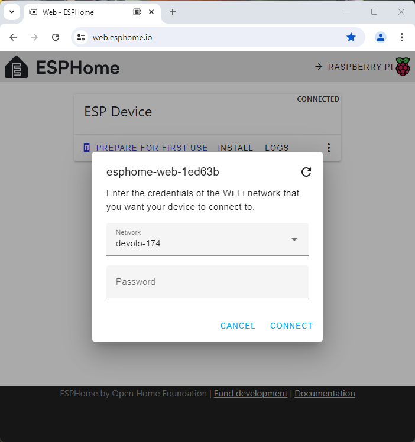

After a few seconds connecting, you'll see: Provisioned!

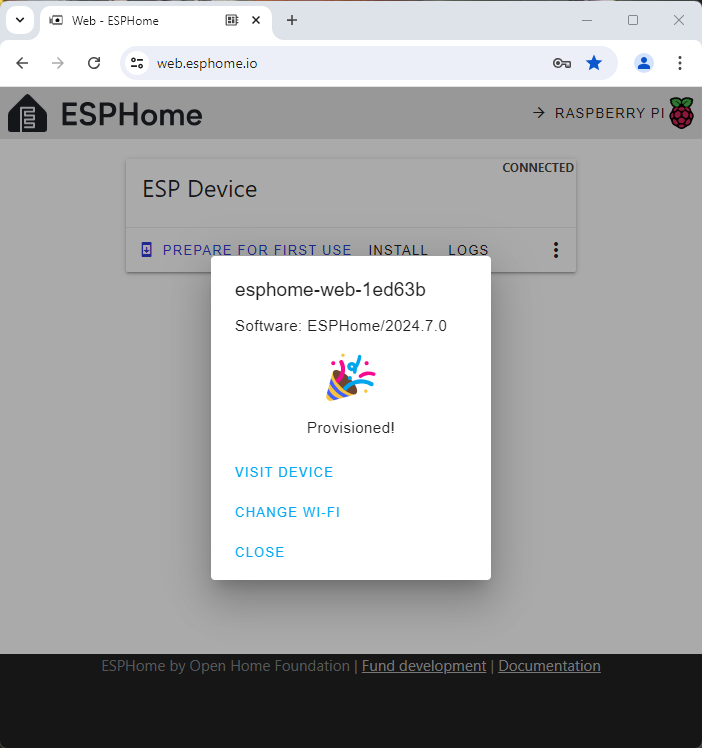

You can CLOSE the dialog.

From here you can connect ESPHome to the ESP using WiFi. The USB cable is now only needed for power supply or if you need to reinitialize the ESP if some configuration went real bad.

## ESPHome

Now the new ESP device should appear in your ESPHome as DISCOVERED, press ADOPT

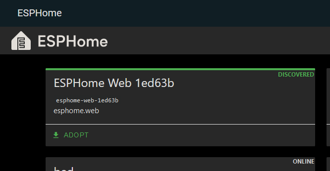

Now you can enter a new name for the ESP and press ADOPT

Hint: It's a good idea to choose a nice name already here. Although the name can also be changed later on, changing it will be additional effort.

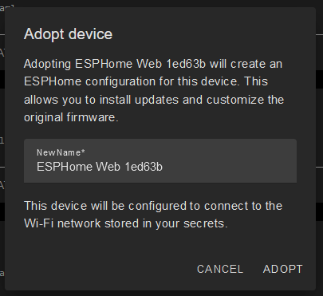

The dialog stays open and shows ADOPTING for a while  (will take a minute or two!)

Once the adopt step has finished, press INSTALL for an initial ESPHome installation on the ESP:

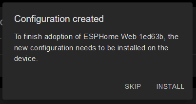

The install will first compile the firmware, downloads it to the ESP and then shows initial log output from the ESP (this will take a minute or two)

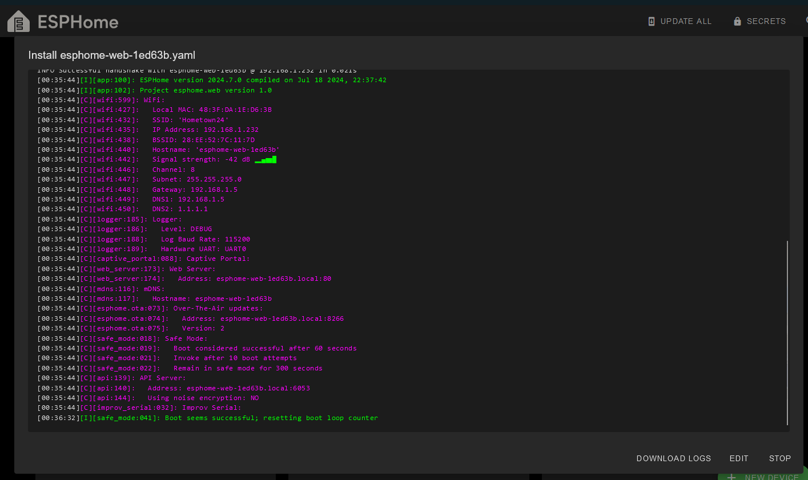

If you see the purple text, ESPHome shows the live log output from the ESP. Press STOP to close the dialog.

## Home Assistant

TODO: I can't really remember what happened with my very first ESPHome device. If I remember correct, Home Assistant noticed me that it found a new device and suggested to install the ESPHome Integration - which I did.

### New Device Integration

Home Assistant automatically detects a new ESPHome device in the network. It will show a notification, click on it:


In the notifications there are New devices discovered, click on Check it out:

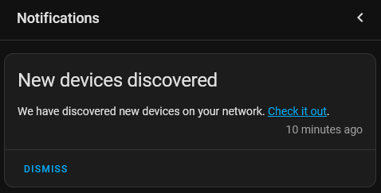

Click on CONFIGURE:

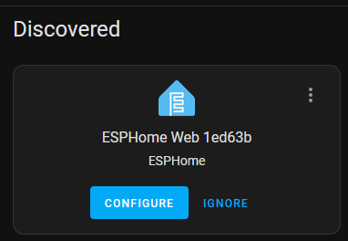

Click on SUBMIT:

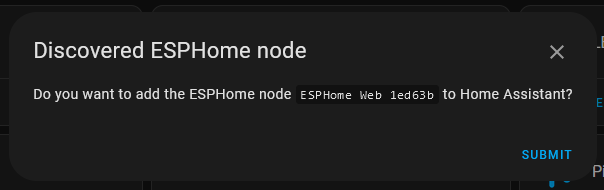

Finally select the Area where the ESP will reside and click on FINISH

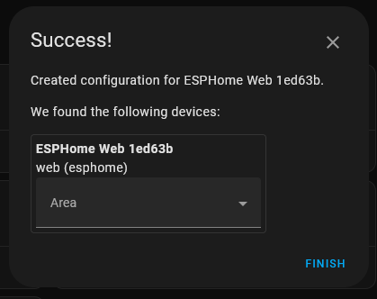

Now the ESP and its entities are ready to be used in Home Assistant.

### Entity Updates

If you add new sensors or such to the ESP and install it, the corresponding entities will automatically appear in Home Assistant after a minute or two. The entities will have a name like: {espname}-{entityname}.

Changing (the name of) existing entities will not be adapted in Home Assistant automatically, so you may need to manually change the UI, automations and such. TODO: Not 100% sure about that.

### Troubleshooting the USB connection

This section gives some hints if the USB connection for the initial setup between the computer and the ESP fails.

As a first step, remove any USB devices that uses a serial connection (microcontroller, GPS devices, ...) to avoid confusion. As these becoming less used today, you probably have none attached. Common USB hardware (keyboard, mouse, audio, ...) won't cause problems.

#### Windows

##### Device Manager

Open the device manager (right click on Windows icon in the taskbar and click "device manager").

If you connect or disconnect the USB cable, you should see **a change in the device manager**. At least it should quickly reload the screen content.

If you see **no change at all**, the USB hardware connection doesn't work. Make sure your cable supports power&data transfer. Try a different USB cable, a different USB port. Have you attached the USB cable to the right computer? Maybe your hardware is broken ...

If you see a new entry under "**Ports (COM & LPT)**" with something like: "USB-SERIAL CH340 (COM3)" (the actual text depends on your specific setup) your connection should work.

If you see a new entry "**Other devices > Unknown device**", you need to install the correct device driver, see next section. Beware: There may be other "Unknown device" entries of unrelated hardware without installed drivers (this happens), so make sure the "Unknown device" is really caused by the ESP by unplugging and replugging it and look for changes.

##### Install the USB Device Driver

The "older (ESP32 / ESP8266) boards uses a "USB to serial" conversion chip. There are different chips used, typical are: CH340, CH9102X, CP2102 but there are others like: CH341, CH342, CH343. Newer chips (ESP32 C3) have this conversion functionality already built in.

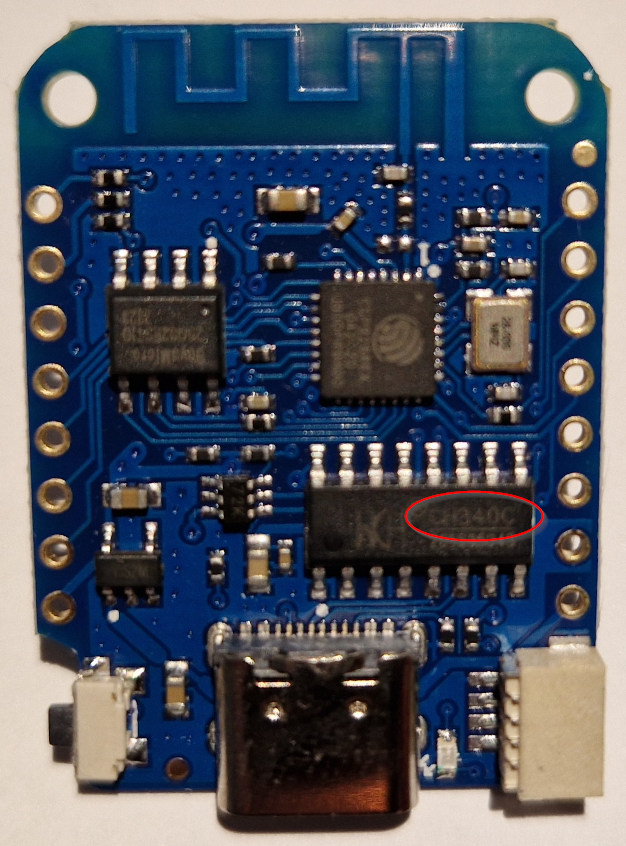
*D1 mini board with a CH340 USB chip*

The chips use different device drivers, so the drivers for a CH340 will not work for the CP2102. To install the correct driver you need to find out which chip is actually used on your board, three possible ways:
* Find the USB vendor and product ids of the chip (see below) and google which chip this is
* You may find this info at the PCB vendors page (beware: Not always correct)
* Have a look at the board with a magnifying glass and look for such a chip, typically near the USB connector. If you are unlucky, the USB chip has no markings on it or for newer ESP chips there is no longer an "external" chip to identify.

To get the product and vendor IDs, right click on the "Unknown device" in the device manager, then Properties > Select the tab: Details > Select Hardware-IDs. You'll need the VID and PID

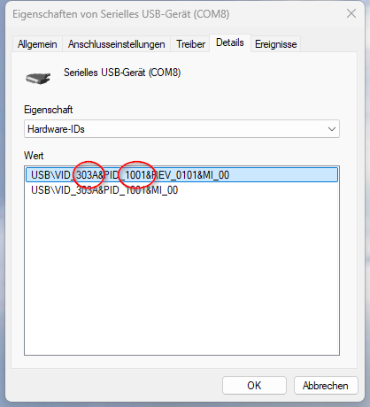

Links to the Windows drivers can be found at the web installer troubleshooting page as mentioned above. Yes, the pages are from chinese manufacturers, so you'll find a lot of chinese characters at the driver pages.

#### Linux

I would expect that the common "USB to serial" chip drivers are already available (at least I've tried on recent debian/Ubuntu and CH340/CP2102).

##### lsusb
To make sure Linux detected the "USB to serial" chip on the ESP board, lsusb can be used to show the devices on the USB bus(ses). Beside some other devices, you may find something like:

```
me@machine:~$ lsusb
...
Bus 002 Device 006: ID 1a86:7523 QinHeng Electronics CH340 serial converter
Bus 001 Device 002: ID 10c4:ea60 Silicon Labs CP210x UART Bridge
Bus 002 Device 008: ID 1a86:55d4 QinHeng Electronics USB Single Serial
Bus 002 Device 002: ID 303a:1001 Espressif USB JTAG/serial debug unit
...
```

* D1-Mini board with CH340
* ESP32 board with CP2102
* ESP32 board with CH9102X
* ESP32-C3 board (without "external" chip)

If you can't see something with "serial" or "UART", probably the USB hardware connection doesn't work. Make sure your cable supports power&data transfer. Try a different USB cable, a different USB port. Have you attached the USB cable to the right computer? Maybe your hardware is broken ...

TODO: I'm not sure what happens, if Linux actually has no driver for the USB vendor/product id? Will this actually happen or are the drivers for all "USB to serial" chips used by the ESP boards are provided with the linux distributions?

##### dmesg
With dmesg you can get more detailed messages, but this can be tricky if you don't know what you are locking for.

```
me@machine:~$ dmesg | grep serial
[    5.074792] usbcore: registered new interface driver usbserial_generic
[    5.074801] usbserial: USB Serial support registered for generic
[    5.105424] usbserial: USB Serial support registered for cp210x

```

The above is from a system that detected a CP2102 about 5s after boot started.

##### Interfering Programs
If you can see the ESP's serial port with lsusb but can't connect to the ESP, some other programs may try to "claim" the serial port. I had trouble with brltty (braille driver), after removing that package the connection was working.

### TODO: Basic ESPHome yaml config

TODO: Add my standard yaml here

TODO: Can't remember: What is the right sequence of changing the yaml, setting ipfire and renaming the ESP?

### IPFire

Optional: Add static IP and DNS for ease of use.

I'm using IPFire to provide DHCP and DNS services, you can probably do similar with pfSense or openSense.

The following steps are for the specific ESP device. I won't go into the general IPFire setup here:

* set static IP (DHCP): Netzwerk > DHCP-Server
* set hostname (DNS): Netzwerk > Hosts bearbeiten

After power cycle the ESP, something like a *ping myesp.lan* should work now.

### TODO: Rename the ESP

TODO: IIRC renaming the ESP can be a bit tricky

TODO: Rename file in docker container from "esphome-123456.yaml" to "myesp.yaml" (there seems to be no way of doing this in the web GUI)
