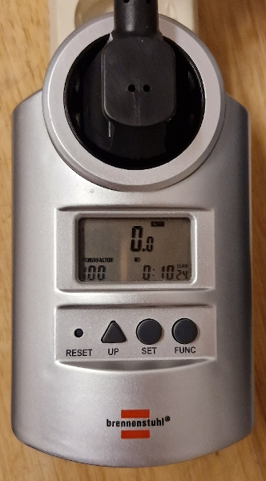
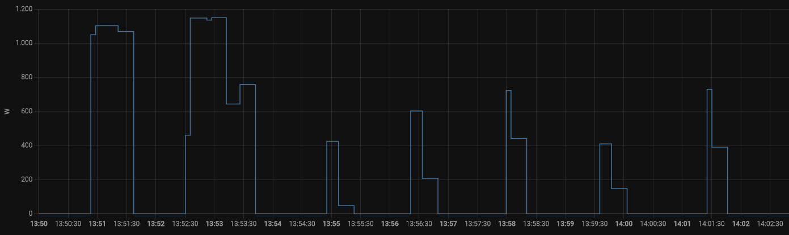
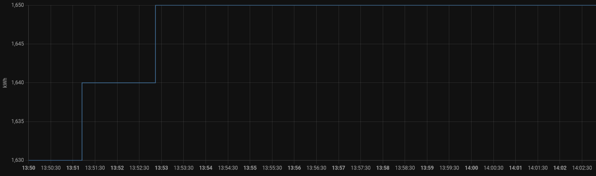

# DeLonghi Inissio (Nespresso) Power Consumption

TODO: Add a photo 

## Standby
The Inissio doesn't have a proper power switch that actually disconnects it from the grid, so it drains power even if its not in use. The question is:

**What's the power consumption of the Inissio in "power off" state?**

My Brennenstuhl power meter "PM 231 E" can't even measure any power consumption!

*Brennenstuhl power meter showing the "power off" consumption: 0.0 W*

Hint: That Brennenstuhl thing is ok measuring very small power levels, so this is not a measurement error.

**-> Its perfectly fine to keep the Inissio connected to the grid, in "off" the consumption is next to zero!**

## One cup of Lungo
The power draw for preparing one cup of Lungo from power on to automatically off again ...

Measuring the power consumption over time is easy with Home Assistant and a cheap TuYa Zigbee power plug. Although these plugs will not qualify as "lab equipment", the differences between the Brennenstuhl and the Tuya Plug is only about 20W at 1000 W load. TODO: Make a more detailed comparison and a photo

*Power consumption in W during the whole coffee making process*

First bump reaching 1100W (1050-1103) is the preheating when the power button is pressed.

Second bump reaching 1150W (1136-1150) is the actual coffee making. There is a difference to the preheating phase of about 50W, which is most likely the consumption of the pump. The drop down to nearly 800W is already after the coffee is finished, the machine seem to preheat for the next coffee.

Next five bumps reaching 800W after the coffee was finished (but LEDs still on), the machine keeps the temperature for about 8 minutes until it shuts off again.

*Energy consumption in kWh during the whole coffee making process*

Although the machine takes more than 1000W peak, it is only doing so for about one minute in total. The energy consumption won't sum up that much.

**The whole process of preparing one cup of coffee Lungo takes only around 0,02 kWh!**

## Conclusion
The power consumption of the Inissio itself is surprisingly low. Consumption in power off can't even be measured.

**One cup of coffee every day would sum up to 7,3 kWh per year.**

(0,02 kWh x 365 = 7,3 kWh, @41ct/kWh => 3 €)

However, the production of the aluminium capsules is a different topic ...
